# DTA客户端字库编译指南
## 元数据
- Version: 1.1
- Author: Shimada Mizuki
- Create Date: 2024/8/16
- Last Update: 2024/8/17

---

## 前言
使用DTA客户端的Modder，肯定有不少人遇到过DTA汉化中文显示成`?`的现象，原因很简单，字库没有那么多字，显示不出来，自然就只能显示成`?`了，毕竟只要它不尴尬，尴尬的就是你。

解决方法很简单：
- 复制心灵终结或者其他中文客户端的字库，覆盖到自己客户端。
- 自己编译一个大字库。
- 自己重写个支持ttf或其他字体的客户端。

当然，你也可能因为各种原因，比如不喜欢自带的字库，或者觉得字体不好看、字库不够大、有些字打不出来，想自己编译字库。编译字库需要基本了解字体和xml文件格式以及编程知识，本教程使用[Python](https://www.python.org/)作为辅助工具。

---

## 目录
- [字库文件介绍](#字库文件介绍)
- [配置环境（难度：★★）](#配置环境)
  - [辅助工具](#辅助工具)
- [编写描述文件（难度：★★★）](#编写描述文件)
  - [通过Python（难度：★★）](#通过Python)
  - [通过Excel（难度：★★★）](#通过Excel)
  - [处理编写结果（难度：★）](#处理编写结果)
- [选择字体（难度：★★★）](#选择字体)
  - [字体的特殊处理（难度：★★★）](#字体的特殊处理)
- [添加字符、汉字（难度：★★★）](#添加字符和汉字)
- [编译字库文件（难度：★★）](#编译字库文件)
  - [调试字库（难度：★★）](#调试字库)
  - [编译字库（难度：★）](#编译字库)
- [编译时长](#编译时长)
- [注意事项](#注意事项)
- [字库的扩展用法（难度：★）](#字库的扩展用法)
- [附件1：实例](#附件1：实例)
- [附件2：常用字库](#附件2：常用字库)
  - [简体字：GB2312（6763字）](#简体字)
  - [繁体字：常用国字标准字体表（4808字）](#繁体字)
  - [简繁混合：方正简繁字表（9664字）](#简繁混合)
- [关于作者](#关于作者)
- [鸣谢名单](#鸣谢名单)

---

## 字库文件介绍 {#字库文件介绍}
XNB文件是Microsoft的XNA Game Studio开发使用的资源文件[^1]，其中可以包含图像、音乐、字体资源，通常无法直接打开。本教程只介绍它在DTA客户端中的用法，也就是字体资源（字库）。

DTA客户端的字库文件通常存放在客户端的`Resources`文件夹中，一般有六个：
  1. `Resources\SpriteFont0.xnb`
  2. `Resources\SpriteFont1.xnb`
  3. `Resources\SpriteFont2.xnb`
  4. `Resources\SpriteFont3.xnb`
  5. `Resources\SpriteFont4.xnb`
  6. `Resources\SpriteFont5.xnb`

其中SpriteFont后面的数字表示程序文本控件调用的FontIndex，FontIndex一般用于选择字体样式，如0/1/2/3分别表示正常、粗体、斜体、粗斜体。文本控件设置`FontIndex=1`表示调用`SpriteFont1.xnb`。

对应下来就是：
  1. `Resources\SpriteFont0.xnb` 正常 `FontIndex=0`
  2. `Resources\SpriteFont1.xnb` 粗体 `FontIndex=1`
  3. `Resources\SpriteFont2.xnb` 斜体 `FontIndex=2`
  4. `Resources\SpriteFont3.xnb` 粗斜体 `FontIndex=3`
  
但只是一般情况，对于大型字库来说给每个样式都弄一个字库既费电又费时，有的客户端偷懒些，六个字库都一模一样，你设哪个FontIndex都没区别，也有的客户端粗体细体相反，只要调换一下文件或FontIndex就行了。

---

## 配置环境 {#配置环境}
电脑上需要安装XNA Game Studio，网上有很多这样的软件包，如[XnaForVS2022](https://github.com/mediaexplorer74/XNBBuilder/releases/download/v1.0/XnaForVS2022.zip)，编译DTA客户端的时候就会用到，但是编译DTA一般只用安装.net和XNA的Visual Studio扩展（可能每个人情况不一样？）。

完整的环境有五个软件：  

1. DirectX
2. XNA Framework 4.0 Redistribution
3. XNA Game Studio 4.0 Platform Tools
4. XNA Game Studio 4.0 Shared
5. XNA Game Studio 4.0.vsix

将这五个软件各安装一遍，再下载[XNAContentComplier](https://github.com/mattleibow/XNA-4.0-Content-Compiler/releases)。

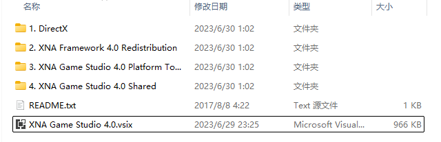

### 辅助工具 {#辅助工具}
- 你需要文本编辑器编写描述文件，可以是自带的记事本，不过为了<font style=color:grey>~~看起来高级~~</font>便于观察，推荐使用[Visual Studio Code](https://code.visualstudio.com/)。
- 有些字体可能不支持在Style中设置Bold，此时可以使用[FontCreator](https://fontcreator.com.cn/)编辑字体，比如加粗。
- 编写众多字符的字库时一个个写区间肯定是不妥的，可以使用[Python](https://www.python.org/)或者Excel辅助编写文档。

---

## 编写描述文件 {#编写描述文件}
首先在桌面上（或者任何一个地方）创建一个文件SpriteFont0.spritefont。 <font style=color:grey>~~别像我一样打成springfont~~</font>  
在文件中添加以下内容：

``` xml
<?xml version="1.0" encoding="utf-8"?>
<XnaContent xmlns:Graphics="Microsoft.Xna.Framework.Content.Pipeline.Graphics">
  <Asset Type="Graphics:FontDescription">
    <FontName>宋体</FontName>    <!-- 字体名称 -->
    <Size>11</Size>    <!-- 字体大小 -->
    <Spacing>1</Spacing>    <!-- 字体间距 -->
    <UseKerning>true</UseKerning>    <!-- 字体布局 -->
    <Style>Regular</Style>    <!-- 字体样式 -->
    <DefaultCharacter>?</DefaultCharacter>    <!-- 缺省字符 -->
    <CharacterRegions>    <!-- 字符集合 -->
      <CharacterRegion>    <!-- 字符 -->
        <Start>&#32;</Start>     <!-- 起始字符 -->
        <End>&#126;</End>     <!-- 结束字符，示例这个表示字母数字和符号 -->
      </CharacterRegion>
    </CharacterRegions>
  </Asset>
</XnaContent>
```

> **以下内容改编自微软的[Spritefont基本格式](https://learn.microsoft.com/en-us/previous-versions/windows/xna/bb447759(v=xnagamestudio.42))。**
各项参数介绍：
> |标签名|参数类型|描述|
> |---|---|---|
> |`<FontName>`|文本|**字体名称**：你要用什么字体编译。|
> |`<Size>`|数字|**字体大小**：DTA客户端的字体一般是14px的，但Size不能填14。如果使用宋体，size要填写11，如果是不包含汉字的西文字体需要填10。|
> |`<Spacing>`|数字|**字体间距**：每个字符间的间隔。|
> |`<UseKerning>`|是非值（true、false）|**字体布局**：微软说的是设置为true就读取间距，设置false就不读取，反正true就对了。|
> |`<Style>`|Regular、Bold、Italic、Bold Italic|**字体样式**：如前面四个参数分别为正常、粗体、斜体、粗斜体等，有的字体不支持某一样式时会报错。|
> |`<DefaultCharacter>`|单个字符（单个字符可以使用编码代替，如`&#x3f;`表示`? (U+003f)`）|**缺省字符**：缺字的时候替换为哪个字符。这个非常关键，因为如果你不设置这个，客户端缺字会直接崩溃（我的客户端不会告诉我缺了哪个字），你字库八成就白做了。|
> |`<CharacterRegions>`|`<CharacterRegion>`标签|**字符集合**：`<CharacterRegions></CharacterRegions>`之间可以包含很多个字符区间。|
> |`<CharacterRegion>`|`<Start>`和`<End>`标签|**字符区间**：表示包含哪些字符，从`<Start>`（起始字符）开始到`<End>`（结束字符）结束，结束字符也包含在内（Python的End是不包含的，以示区分），当两者相同时表示只有这个字符。|
> |`<Start>`|单个字符|**起始字符**：指Unicode中从哪个字符开始选取。|
> |`<End>`|单个字符|**结束字符**：指Unicode中从哪个字符结束（必须比起始字符大）。|

如以下例子，指的是包含unicode第32个字符到unicode第126个字符的字符区间（Start小End大，不要搞反了）。

> **注意**
> 微软没给编码加`&#`和`;`，你知道加上就行了，你学他只会报错。因为程序将数字识别为字符，多位数会被识别为多个字符，而`<Start>`和`<End>`只能包含单个字符。使用编码必须带上`&#`和`;`。

``` xml
<Start>&#32;</Start><End>&#126;</End>
```

转换成字符也就是这样：

```
(U+0020 空格)!"#$%&'()*+,-./0123456789:;<=>?@ABCDEFGHIJKLMNOPQRSTUVWXYZ[\]^_`abcdefghijklmnopqrstuvwxyz{|}~(U+007E 波浪号)
```

但是Unicode使用十六进制数字，而每次十六进制转十进制很麻烦。区间最好不要有带本节图二的红叉的字符，我之前因为这个报错过，但是后面做好像又不报错，不确定。

计算方法：
1. 打开计算器选择程序员模式。
2. 把十进制数输入到DEC里，HEX里得到它的十六进制。
3. 把十六进制数输入到HEX里，DEC得到十进制。

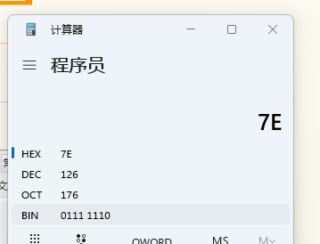

为了方便（不用计算）可以写成如下形式（也就是在十六进制数前面加个x），其实就是html和xml的基本格式。
``` xml
<Start>&#x20;</Start><End>&#x7E;</End>
```

如果你熟悉Unicode中字符的编码顺序，你完全可以使用字符代替编码，毕竟更好输入：

``` xml
<!-- 注意：空格也会被识别为字符，也就是说你不小心混了个空格进去也是会报错的。-->
<Start> </Start><End>~</End>
```

---

## 选择字体 {#选择字体}
选择字体虽然说起来很简单，但是因为DTA客户端的局限性，很多字体都不能用于编译字库。编译字库最好不要选择微软雅黑或艺术字之类的字体，不然会像下面这样**糊成一坨**：


建议使用的字体类型（要设置的大小）：
- 宋体（11）
- Arial（10）
- 16px像素字体（12）
- 自带点阵的字体（一般为11）
- ...

而且微软雅黑有版权，一旦涉及侵权责任重大，建议使用OFL/IPA等协议的开源字体避免版权纠纷：推荐我本人就在用的文泉驿点阵宋体16px。

像素字体可以在[Github](https://github.com)上搜索像素体或者[猫啃网专区](https://www.maoken.com/tag/%e5%83%8f%e7%b4%a0%e4%bd%93/)下载。

一般而言只生成细体就够了，因为客户端几乎不使用斜体，粗体占比也很少，原本的字库够用就行了。

### 字体的特殊处理 {#字体的特殊处理}
有一些字体不支持Bold样式或者Bold样式特别炸裂，需要自行在FontCreator中处理：
- 对于像素字体，可以选择小一半的px，比如8px，然后调整下描述文件里的Size。
- 打开字体项目。
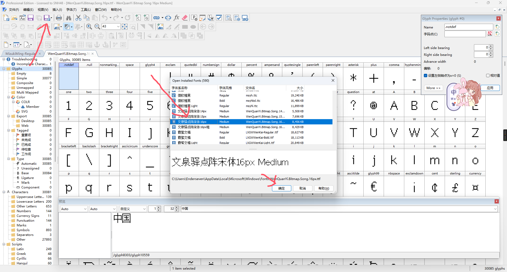
- 打开字形变换器。选择全部→效果`Effects`→加粗`Bold`。水平和垂直一般为字体的笔画宽度的一半（点阵则为一格的一半）。下面的两个复选框不要勾选。
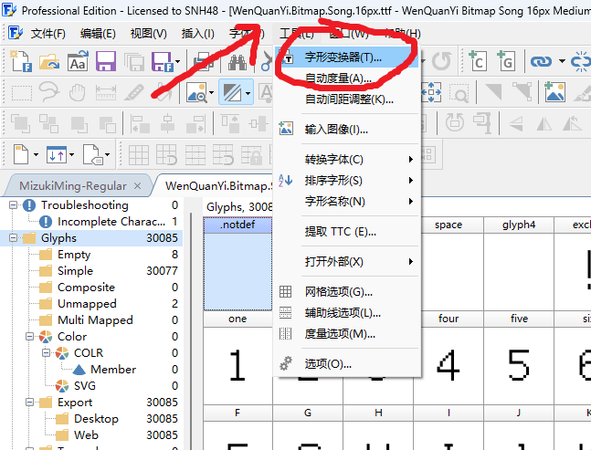
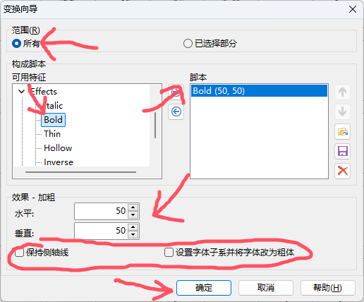
- 修改一下字体信息，比如在每个语言的名字上加个“粗”字。
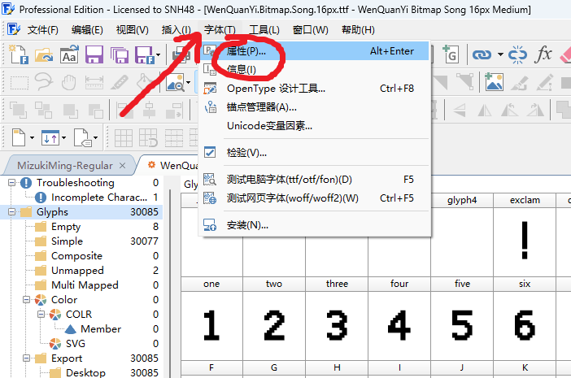
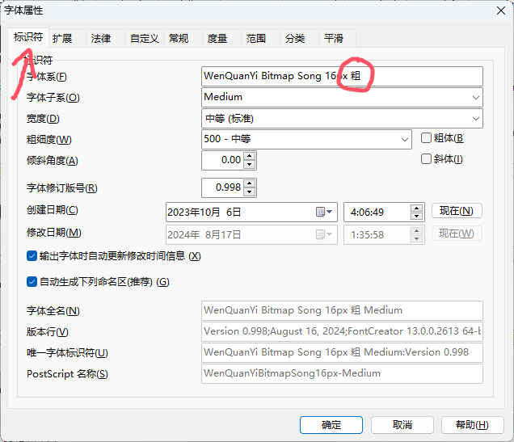
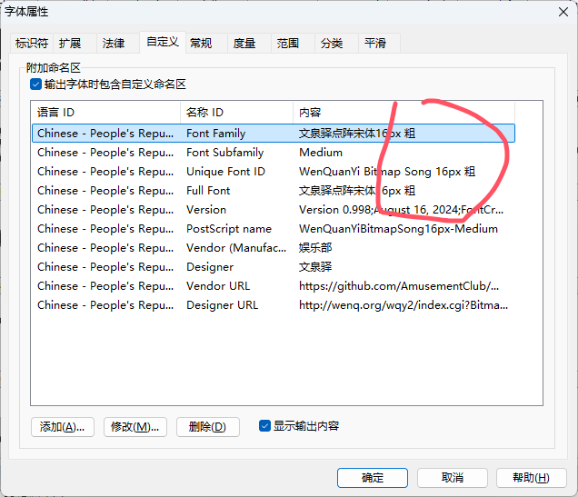
- 导出，然后安装，重启XNAContentComplier，修改粗体spritefont里的字体名（`<FontName>`）为你刚才改的。
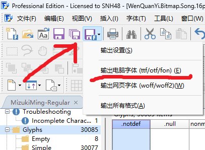

当然，如果搞不好会更炸裂。通过这种方式生成的粗体一般都没有间距，需要在`<Spacing>`和`</Spacing>`中设置1/2来保持间距，不然会糊成一坨。

---

## 添加字符和汉字 {#添加字符和汉字}
首先加上字母数字和符号，也就是上面的例子。

``` xml
<Start>&#x20;</Start><End>&#x7E;</End>
```

其他拉丁字母及扩展如下：

``` xml
<CharacterRegion><Start>&#xA0;</Start><End>&#x36F;</End></CharacterRegion>
```

添加希腊字母、西里尔字母同理，只要找到区间就行，格外小心这些带红叉的字符，因为这些字符在
Unicode中不赋值，将它包括在区间里可能会报错。

``` xml
<!-- 已排除红叉字符 -->
<CharacterRegion><Start>&#x370;</Start><End>&#x377;</End></CharacterRegion>
<CharacterRegion><Start>&#x37A;</Start><End>&#x37F;</End></CharacterRegion>
<CharacterRegion><Start>&#x384;</Start><End>&#x38A;</End></CharacterRegion>
<CharacterRegion><Start>&#x38C;</Start><End>&#x38C;</End></CharacterRegion>
<CharacterRegion><Start>&#x38E;</Start><End>&#x52F;</End></CharacterRegion>
```

若将红叉字符包括在其中，代码如下：

``` xml
<CharacterRegion><Start>&#x38E;</Start><End>&#x52F;</End></CharacterRegion>
```

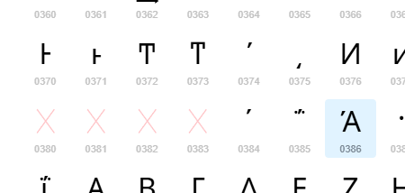

添加汉字到描述文件中很简单，只需要找到汉字的编码区间（U+4E00~U+9FFF）：

``` xml
<!-- 中日韩统一表意文字扩展A -->
<CharacterRegion><Start>&#x3400;</Start><End>&#x4DBF;</End></CharacterRegion>
<!-- 中日韩统一表意文字 -->
<CharacterRegion><Start>&#x4E00;</Start><End>&#x9FFF;</End></CharacterRegion>
```

但是这样下来编译的时间太长了，毕竟这个编码区间有将近三万字，哪怕不带扩展A区也有两万一千个字了，所以可以找一个合适的字库或编码：
- 方正简繁字表（简繁，9664个字）
- 义务教育常用字表（简体字，3500个字）
- 通用规范汉字表（简体字，8105个字）
- GB2312（简体字，6763个字）
- ...

这些字库能汇总常用的汉字，排除掉那些可能这辈子都用不到的汉字，缩短编译时间，减轻电脑负担，压缩字库大小。当然不是字数越少越好，毕竟字数越少代表着缺字的可能性越大，所以不要偷懒套义务教育常用字表。字库文件来自夜煞之乐的[字体计数器](https://github.com/NightFurySL2001/CJK-character-count)。

> **注意**
> GB2312编码缺少“啰”“瞭”两个常用字，需要自行补充。
> 粗体（`FontIndex=1`）文字通常用于UI、标题的文本，而这些文本顶多就那么几个，也不一定经常修改、加新字，心灵终结或其他MOD的中文字库绰绰有余，一般而言只要生成`SpriteFont0.xnb`就完全够用了，毕竟能用到大字库的大部分都是`FontIndex=0`的聊天框，一些人聊天的时候会发一堆奇奇怪怪的生僻字，如火星文。
> 
> 假如你要支持火星文，那么常用字库（如GB2312、方正简繁字表等）是完全不够的，应当使用上文的代码将整个编码区包起来（可以排除扩展A），相应的代价就是**极长的编译耗时**，没个一两宿根本下不来的那种。

根据需求选择好字库以后，为了方便起见，可以利用程序自动生成`<CharacterRegion>`，有两种方法：

### 通过Python {#通过Python}
> 优点：快捷、可以自由处理格式。
> 缺点：需要编程基础和Python环境。

将字库内容塞进Python里，用for循环生成字符集合。

``` python
# -*- coding:utf-8 -*-
a='你的字库' # 输入你的字库，存储到字符串变量
for i in a: # 遍历字库
    print('      <CharacterRegion><Start>'+i+'</Start><End>'+i+'</End></CharacterRegion>') #输出。为了节省空间我把四行缩成一行，不影响结果。
```

扩展B区（表意文字补充平面）之后的汉字因编码原因会提示**字符串的长度必须正好为一个字符**，解决方法：
**1.把传入字符改为传入编码。**

> 此方法针对于**需要**扩展区汉字的用户。

``` python
# -*- coding:utf-8 -*-
a='你的字库'
for i in a:
    # print('      <CharacterRegion><Start>'+i+'</Start><End>'+i+'</End></CharacterRegion>') 注释掉原来的方法
    print('      <CharacterRegion><Start>&#'+str(ord(i))+';</Start><End>&#'+str(ord(i))+';</End></CharacterRegion>') #输出。为了节省空间我把四行缩成一行，不影响结果。
```

**2.把字库转换成列表排序一下，复制到文本编辑器里，删掉后面扩展B区后面的字。**

> 此方法针对于**不需要**扩展区汉字的用户。

``` python
# -*- coding:utf-8 -*-
a=list('你的字库') # 把字库转为列表
a.sort() # 排序一下，编码大（B区之后）的在后面
print(''.join(a)) # 转为字符串输出
```
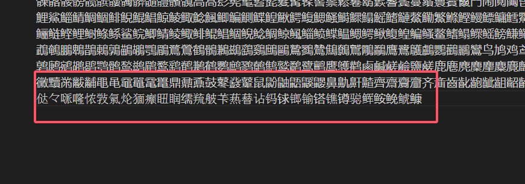
编辑器字体调成微软雅黑，可以看到后面的字很明显风格不一样，因为微软雅黑不支持扩展B区后面的字。如果安装了诸如[遍黑体](https://github.com/Fitzgerald-Porthmouth-Koenigsegg/Plangothic-Project)一类具有大字库的黑体，则会使影响判断，此时可以改用宋体显示，或者利用1、3方法。

**3.直接抹掉扩展B区之后的汉字（扩展B区的起始编码为U+20000）。**

> 此方法针对于**不需要**扩展区汉字的用户。

``` python
# -*- coding:utf-8 -*-
a='你的字库'
for i in a:
    if ord(i) < 0x20000: #排除码位在U+20000之后的字符
        print('      <CharacterRegion><Start>'+i+'</Start><End>'+i+'</End></CharacterRegion>')
```

> **提示**
> 如果你的鼠标故障，经常连点误触，那么可以选择将输出的`<CharacterRegion>`写入到文件中再全选复制。
> 
> ``` python
> # -*- coding:utf-8 -*-
> a = '你的字库'
> b = open('文件路径', 'w+', encoding='utf-8')
> for i in a: # 遍历字库
>     b.write('      <CharacterRegion><Start>'+i+'</Start><End>'+i+'</End></CharacterRegion>') # 将输出内容写入文件
> ```

### 通过Excel {#通过Excel}
> 该方法来自于[豺禄](https://space.bilibili.com/599350756)的专栏[SpriteFont生成的一些细则](https://www.bilibili.com/read/cv16344778/)。
> 优点：该软件大部分电脑上都有。
> 缺点：操作不是很方便。

Excel批量填充，中文编码填充得到格式。
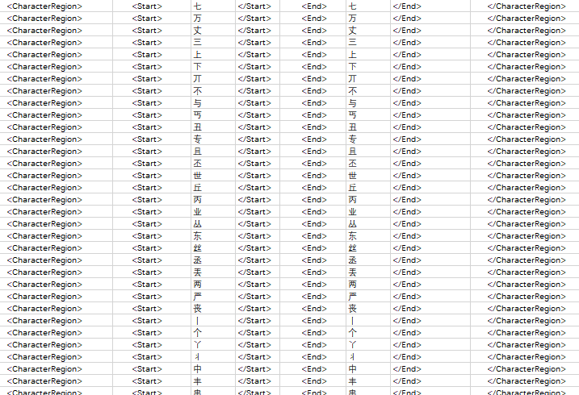
Excel写入
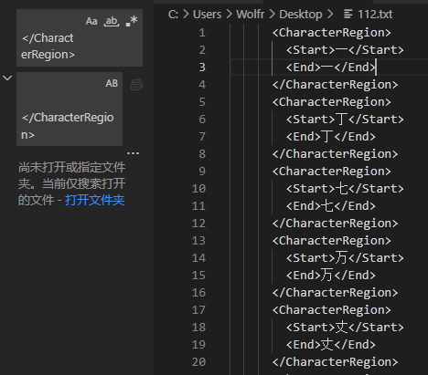
Vscode批量替换来生成所需格式（自然Notepad++也可以）

### 处理编写结果 {#处理编写结果}

最后将复制的内容粘贴到`<CharacterRegions>`的最后一个`</CharacterRegion>`后面，得到如下：

``` xml
<?xml version="1.0" encoding="utf-8"?>
<XnaContent xmlns:Graphics="Microsoft.Xna.Framework.Content.Pipeline.Graphics">
  <Asset Type="Graphics:FontDescription">
    <FontName>宋体</FontName>
    <Size>11</Size>
    <Spacing>1</Spacing>
    <UseKerning>true</UseKerning>
    <Style>Regular</Style>
    <DefaultCharacter>?</DefaultCharacter>
    <CharacterRegions>
      <CharacterRegion>
        <Start>&#x20;</Start>
        <End>&#x7E;</End>
      </CharacterRegion>
      <CharacterRegion><Start>嗚</Start><End>嗚</End></CharacterRegion>
      <CharacterRegion><Start>嗜</Start><End>嗜</End></CharacterRegion>
      ...
      <CharacterRegion><Start>嗬</Start><End>嗬</End></CharacterRegion>
      <CharacterRegion><Start>嗮</Start><End>嗮</End></CharacterRegion>
    </CharacterRegions>
  </Asset>
</XnaContent>
```

补上中文用的符号，描述文件就写好了。

``` xml
<CharacterRegion><Start>&#x2010;</Start><End>&#x205E;</End></CharacterRegion> <!-- 常用标点 -->
<CharacterRegion><Start>&#x3000;</Start><End>&#x303F;</End></CharacterRegion> <!-- 中日韩标点 -->
<CharacterRegion><Start>&#xFF01;</Start><End>&#xFF65;</End></CharacterRegion> <!-- 全角标点 -->
```

---

## 编译字库文件 {#编译字库文件}

打开XNAContentComplier：
1. 点击`Add Content`。
2. 选择`spritefont files`。
3. 找到刚才编写的`SpriteFont0.spritefont`，添加进去。
4. 点击`Project Settings`，在`Output Directory`里填写输出文件夹。
5. 上面的`Compressed`是压缩的意思，如果你的字库比较大可以选择开启此选项，开启后原本几MB的字库会压缩到几百K，但是对编译速度的影响未知。

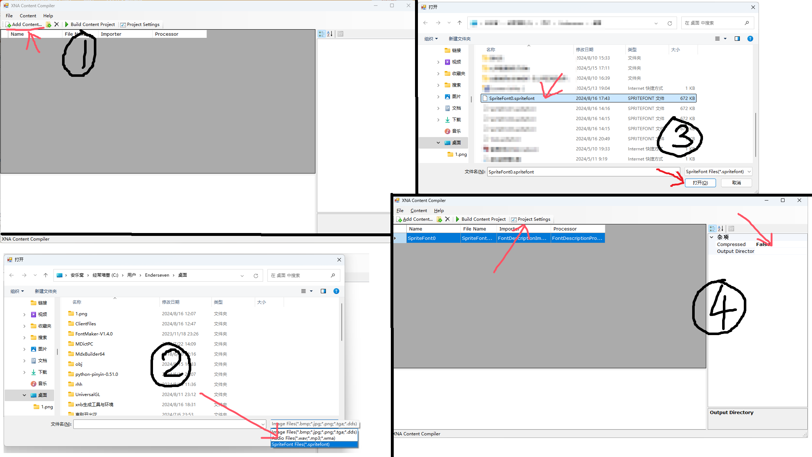

### 调试字库 {#调试字库}
如果不调试，直接编译，一天过去了，万一结果是这样……

炸裂（俗称绮丽）也没关系……毕竟亲生的……

所以编写好描述文件以后，需要先调试一下，确保编译的效果没问题，不然生成个两三天看到生成的这个鸟样心态要炸。最简单的方法有两种：
- 将大部分汉字注释掉，只留英文数字符号和少量汉字（1000个字符以下），但是这种办法会导致很多`?`不便观察。
- 编译一个囊括你的客户端所有UI使用到的汉字的字库。
  - **新版客户端**：找到你的`Translation.ini`，复制，塞进python里去重，得到仅包含UI文本的字库：

  ```python
  print(''.join(list(set('''ini内容''')))) # 注意这里要用三引号('''''')表示多行字符串
                                                         # 因为你的Translation.ini不可能只有一行
  ```

  - **旧版客户端**：旧版客户端汉化在源码里，汉字又分布在各个不同的文件中，复制源码固然是行不通的，我们可以挑一个汉字比较多的ini，如`MPMaps.ini`（如果你汉化了地图名称的话）、`GameOptions.ini`（如果你做了中文游戏选项），复制下来，套进上文的代码里。

字库生成描述文件的方法见前章节[编写描述文件](#编写描述文件)。


**开始编译：**
按上面的Build Content Project，右下角出现加载条且没有弹出异常就说明字库开始编译了。
编译完的xnb跟你的spritefont同名，也就是说我放SpriteFont0.spritefont编译出的就是SpriteFont0.xnb。

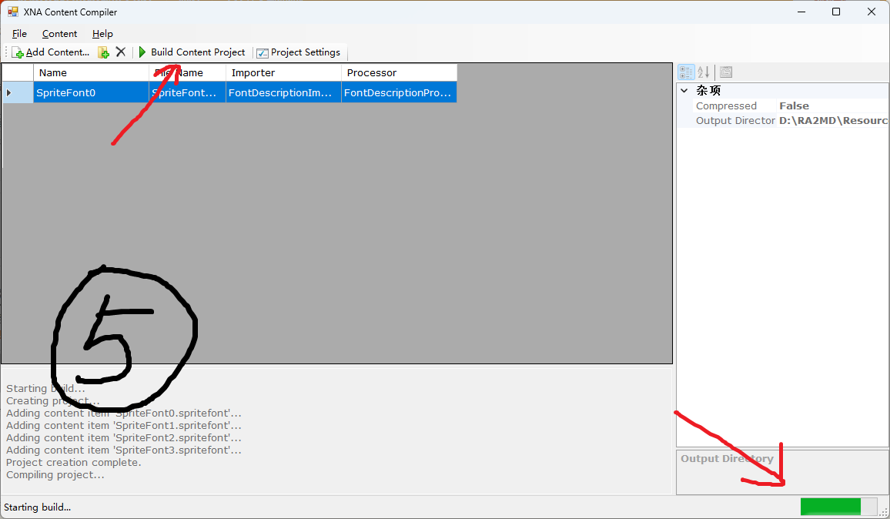

把编译出来的xnb覆盖到你的客户端里即可。

编译完如果出现异常，可以查看异常原因：
- **字符串的长度必须正好为一个字符**：看看有没有输入扩展B区之后的字符，以及有没有空字符，字符里有没有混了个空格，比如`<CharacterRegion><Start>`<font style=background:red> </font>`草</Start><End>草</End></CharacterRegion>`，有没有编码忘记加上`&#`和`;`。
- **未能从程序集 Microsoft.Xna.Framework.Content.Pipeline……**：没安装就安装开头提供的文件，如果安装过就卸载了重新安装一遍。
- **System.ArgumentNullException: 值不能为 null。参数名: path……**：输出文件夹没写。由于这个错误只有编译完了才会有，当弹出来这个异常的时候就说明你白编译了，所以一定要填写，没写的话关掉窗口重新执行上述步骤。
- **“xxx”是无效的 XmlNodeType**：看看你有没有在文件里不小心多打了什么奇怪的东西破坏了格式。
- **XML contains invalid value "xxx" for enum...FontDescriptionStyle**：字体不支持这一样式。

### 编译字库 {#编译字库}
确认无误后，将注释掉的字符取消注释，按照以上步骤编译即可。

---

## 编译时长 {#编译时长}
XNB文件本身用于表音文字是很方便的，拉丁文字、希腊文、西里尔文加起来也不过千百个，但是用于数量如此庞大的汉字时就显得十分鸡肋。

我的电脑配置编译几百字符的xnb不在话下，一两千个字符也只用最多几分钟，但这个用时似乎是呈指数型增长的，也就是说你不能自然而然的认为编译一千个字符要一分钟，一万个字符就只要十分钟而已。我昨天凌晨四点编译了两个八千字的字库（一粗一细），早上六点起刚好编译完，所以时间是很悬的，一万个字符没个两三小时根本下不来。最好的办法就是你晚上编写好，打开编译，睡一觉就好了。

你也可以白天编译，你去干别的，总之等着就对了。

> **我的配置如下：**
> 处理器	12th Gen Intel(R) Core(TM) i3-12100   3.30 GHz
> 机带 RAM	16.0 GB (15.7 GB 可用)
> 系统类型	64 位操作系统, 基于 x64 的处理器

---

## 注意事项 {#注意事项}
- 此方法生成的汉字会向上偏移，目前原因未知，似乎在使用西文字体渲染汉字时现象最明显。
- 注意字体的版权问题，有些厂商的字体并不完全开放授权。

---

## 字库的扩展用法 {#字库的扩展用法}
在[xna-cncnet-client的develop分支](https://github.com/CnCNet/xna-cncnet-client/tree/develop)（俗称新版客户端）中，可以利用客户端的翻译功能，将字库文件放在翻译文件夹下，给不同的语言安排不同的字库文件。

---

## 附件1：实例 {#附件1：实例}
以义务教育常用字表为例（有省略）：

``` xml
<?xml version="1.0" encoding="utf-8"?>
<XnaContent xmlns:Graphics="Microsoft.Xna.Framework.Content.Pipeline.Graphics">
  <Asset Type="Graphics:FontDescription">
    <FontName>宋体</FontName>
    <Size>11</Size>
    <Spacing>1</Spacing>
    <UseKerning>true</UseKerning>
    <Style>Bold Italic</Style>
    <DefaultCharacter>?</DefaultCharacter>
    <CharacterRegions>
      <CharacterRegion><Start>&#x20;</Start><End>&#x7E;</End></CharacterRegion>
      <CharacterRegion><Start>&#x2010;</Start><End>&#x205E;</End></CharacterRegion>
      <CharacterRegion><Start>&#x3000;</Start><End>&#x303F;</End></CharacterRegion>
      <CharacterRegion><Start>阿</Start><End>阿</End></CharacterRegion>
      <CharacterRegion><Start>啊</Start><End>啊</End></CharacterRegion>
      <CharacterRegion><Start>哎</Start><End>哎</End></CharacterRegion>
      <CharacterRegion><Start>哀</Start><End>哀</End></CharacterRegion>
      <CharacterRegion><Start>唉</Start><End>唉</End></CharacterRegion>
      <CharacterRegion><Start>埃</Start><End>埃</End></CharacterRegion>
      <CharacterRegion><Start>挨</Start><End>挨</End></CharacterRegion>
      <CharacterRegion><Start>癌</Start><End>癌</End></CharacterRegion>
      <CharacterRegion><Start>矮</Start><End>矮</End></CharacterRegion>
      <CharacterRegion><Start>艾</Start><End>艾</End></CharacterRegion>
      <CharacterRegion><Start>爱</Start><End>爱</End></CharacterRegion>
      <CharacterRegion><Start>碍</Start><End>碍</End></CharacterRegion>
      <CharacterRegion><Start>安</Start><End>安</End></CharacterRegion>
      <CharacterRegion><Start>氨</Start><End>氨</End></CharacterRegion>
      <CharacterRegion><Start>俺</Start><End>俺</End></CharacterRegion>
      <CharacterRegion><Start>岸</Start><End>岸</End></CharacterRegion>
      <CharacterRegion><Start>按</Start><End>按</End></CharacterRegion>
      <CharacterRegion><Start>案</Start><End>案</End></CharacterRegion>
      <CharacterRegion><Start>暗</Start><End>暗</End></CharacterRegion>
      <CharacterRegion><Start>昂</Start><End>昂</End></CharacterRegion>
      <CharacterRegion><Start>凹</Start><End>凹</End></CharacterRegion>
      <CharacterRegion><Start>熬</Start><End>熬</End></CharacterRegion>
      <CharacterRegion><Start>傲</Start><End>傲</End></CharacterRegion>
      <CharacterRegion><Start>奥</Start><End>奥</End></CharacterRegion>
      <CharacterRegion><Start>澳</Start><End>澳</End></CharacterRegion>
      <CharacterRegion><Start>八</Start><End>八</End></CharacterRegion>
      <CharacterRegion><Start>巴</Start><End>巴</End></CharacterRegion>
      <CharacterRegion><Start>叭</Start><End>叭</End></CharacterRegion>
      <CharacterRegion><Start>吧</Start><End>吧</End></CharacterRegion>
      <CharacterRegion><Start>拔</Start><End>拔</End></CharacterRegion>
      <CharacterRegion><Start>把</Start><End>把</End></CharacterRegion>
      <CharacterRegion><Start>坝</Start><End>坝</End></CharacterRegion>
      <CharacterRegion><Start>爸</Start><End>爸</End></CharacterRegion>
      <CharacterRegion><Start>罢</Start><End>罢</End></CharacterRegion>
      <CharacterRegion><Start>霸</Start><End>霸</End></CharacterRegion>
      <CharacterRegion><Start>白</Start><End>白</End></CharacterRegion>
      <CharacterRegion><Start>百</Start><End>百</End></CharacterRegion>
      <CharacterRegion><Start>柏</Start><End>柏</End></CharacterRegion>
      <CharacterRegion><Start>摆</Start><End>摆</End></CharacterRegion>
      <CharacterRegion><Start>败</Start><End>败</End></CharacterRegion>
      <CharacterRegion><Start>拜</Start><End>拜</End></CharacterRegion>
      <CharacterRegion><Start>班</Start><End>班</End></CharacterRegion>
      <CharacterRegion><Start>般</Start><End>般</End></CharacterRegion>
      <CharacterRegion><Start>颁</Start><End>颁</End></CharacterRegion>
      <CharacterRegion><Start>斑</Start><End>斑</End></CharacterRegion>
      <CharacterRegion><Start>搬</Start><End>搬</End></CharacterRegion>
      <CharacterRegion><Start>板</Start><End>板</End></CharacterRegion>
      <CharacterRegion><Start>版</Start><End>版</End></CharacterRegion>
      <CharacterRegion><Start>办</Start><End>办</End></CharacterRegion>
      <CharacterRegion><Start>半</Start><End>半</End></CharacterRegion>
      <CharacterRegion><Start>伴</Start><End>伴</End></CharacterRegion>
      <CharacterRegion><Start>扮</Start><End>扮</End></CharacterRegion>
      <CharacterRegion><Start>瓣</Start><End>瓣</End></CharacterRegion>

      <!-- 此处已省略部分内容... -->
      <CharacterRegion><Start>揍</Start><End>揍</End></CharacterRegion>
      <CharacterRegion><Start>卒</Start><End>卒</End></CharacterRegion>
      <CharacterRegion><Start>佐</Start><End>佐</End></CharacterRegion>
      <CharacterRegion><Start>&#xFF01;</Start><End>&#xFF65;</End></CharacterRegion>
    </CharacterRegions>
  </Asset>
</XnaContent>
```

---

## 附件2：常用字库 {#附件2：常用字库}
### 简体字——GB2312（6763字） {#简体字}
啊阿埃挨哎唉哀皑癌蔼矮艾碍爱隘鞍氨安俺按暗岸胺案肮昂盎凹敖熬翱袄傲奥懊澳芭捌扒叭吧笆八疤巴拔跋靶把耙坝霸罢爸白柏百摆佰败拜稗斑班搬扳般颁板版扮拌伴瓣半办绊邦帮梆榜膀绑棒磅蚌镑傍谤苞胞包褒剥薄雹保堡饱宝抱报暴豹鲍爆杯碑悲卑北辈背贝钡倍狈备惫焙被奔苯本笨崩绷甭泵蹦迸逼鼻比鄙笔彼碧蓖蔽毕毙毖币庇痹闭敝弊必辟壁臂避陛鞭边编贬扁便变卞辨辩辫遍标彪膘表鳖憋别瘪彬斌濒滨宾摈兵冰柄丙秉饼炳病并玻菠播拨钵波博勃搏铂箔伯帛舶脖膊渤泊驳捕卜哺补埠不布步簿部怖擦猜裁材才财睬踩采彩菜蔡餐参蚕残惭惨灿苍舱仓沧藏操糙槽曹草厕策侧册测层蹭插叉茬茶查碴搽察岔差诧拆柴豺搀掺蝉馋谗缠铲产阐颤昌猖场尝常长偿肠厂敞畅唱倡超抄钞朝嘲潮巢吵炒车扯撤掣彻澈郴臣辰尘晨忱沉陈趁衬撑称城橙成呈乘程惩澄诚承逞骋秤吃痴持匙池迟弛驰耻齿侈尺赤翅斥炽充冲虫崇宠抽酬畴踌稠愁筹仇绸瞅丑臭初出橱厨躇锄雏滁除楚础储矗搐触处揣川穿椽传船喘串疮窗幢床闯创吹炊捶锤垂春椿醇唇淳纯蠢戳绰疵茨磁雌辞慈瓷词此刺赐次聪葱囱匆从丛凑粗醋簇促蹿篡窜摧崔催脆瘁粹淬翠村存寸磋撮搓措挫错搭达答瘩打大呆歹傣戴带殆代贷袋待逮怠耽担丹单郸掸胆旦氮但惮淡诞弹蛋当挡党荡档刀捣蹈倒岛祷导到稻悼道盗德得的蹬灯登等瞪凳邓堤低滴迪敌笛狄涤翟嫡抵底地蒂第帝弟递缔颠掂滇碘点典靛垫电佃甸店惦奠淀殿碉叼雕凋刁掉吊钓调跌爹碟蝶迭谍叠丁盯叮钉顶鼎锭定订丢东冬董懂动栋侗恫冻洞兜抖斗陡豆逗痘都督毒犊独读堵睹赌杜镀肚度渡妒端短锻段断缎堆兑队对墩吨蹲敦顿囤钝盾遁掇哆多夺垛躲朵跺舵剁惰堕蛾峨鹅俄额讹娥恶厄扼遏鄂饿恩而儿耳尔饵洱二贰发罚筏伐乏阀法珐藩帆番翻樊矾钒繁凡烦反返范贩犯饭泛坊芳方肪房防妨仿访纺放菲非啡飞肥匪诽吠肺废沸费芬酚吩氛分纷坟焚汾粉奋份忿愤粪丰封枫蜂峰锋风疯烽逢冯缝讽奉凤佛否夫敷肤孵扶拂辐幅氟符伏俘服浮涪福袱弗甫抚辅俯釜斧脯腑府腐赴副覆赋复傅付阜父腹负富讣附妇缚咐噶嘎该改概钙盖溉干甘杆柑竿肝赶感秆敢赣冈刚钢缸肛纲岗港杠篙皋高膏羔糕搞镐稿告哥歌搁戈鸽胳疙割革葛格蛤阁隔铬个各给根跟耕更庚羹埂耿梗工攻功恭龚供躬公宫弓巩汞拱贡共钩勾沟苟狗垢构购够辜菇咕箍估沽孤姑鼓古蛊骨谷股故顾固雇刮瓜剐寡挂褂乖拐怪棺关官冠观管馆罐惯灌贯光广逛瑰规圭硅归龟闺轨鬼诡癸桂柜跪贵刽辊滚棍锅郭国果裹过哈骸孩海氦亥害骇酣憨邯韩含涵寒函喊罕翰撼捍旱憾悍焊汗汉夯杭航壕嚎豪毫郝好耗号浩呵喝荷菏核禾和何合盒貉阂河涸赫褐鹤贺嘿黑痕很狠恨哼亨横衡恒轰哄烘虹鸿洪宏弘红喉侯猴吼厚候后呼乎忽瑚壶葫胡蝴狐糊湖弧虎唬护互沪户花哗华猾滑画划化话槐徊怀淮坏欢环桓还缓换患唤痪豢焕涣宦幻荒慌黄磺蝗簧皇凰惶煌晃幌恍谎灰挥辉徽恢蛔回毁悔慧卉惠晦贿秽会烩汇讳诲绘荤昏婚魂浑混豁活伙火获或惑霍货祸击圾基机畸稽积箕肌饥迹激讥鸡姬绩缉吉极棘辑籍集及急疾汲即嫉级挤几脊己蓟技冀季伎祭剂悸济寄寂计记既忌际妓继纪嘉枷夹佳家加荚颊贾甲钾假稼价架驾嫁歼监坚尖笺间煎兼肩艰奸缄茧检柬碱硷拣捡简俭剪减荐槛鉴践贱见键箭件健舰剑饯渐溅涧建僵姜将浆江疆蒋桨奖讲匠酱降蕉椒礁焦胶交郊浇骄娇嚼搅铰矫侥脚狡角饺缴绞剿教酵轿较叫窖揭接皆秸街阶截劫节桔杰捷睫竭洁结解姐戒藉芥界借介疥诫届巾筋斤金今津襟紧锦仅谨进靳晋禁近烬浸尽劲荆兢茎睛晶鲸京惊精粳经井警景颈静境敬镜径痉靖竟竞净炯窘揪究纠玖韭久灸九酒厩救旧臼舅咎就疚鞠拘狙疽居驹菊局咀矩举沮聚拒据巨具距踞锯俱句惧炬剧捐鹃娟倦眷卷绢撅攫抉掘倔爵觉决诀绝均菌钧军君峻俊竣浚郡骏喀咖卡咯开揩楷凯慨刊堪勘坎砍看康慷糠扛抗亢炕考拷烤靠坷苛柯棵磕颗科壳咳可渴克刻客课肯啃垦恳坑吭空恐孔控抠口扣寇枯哭窟苦酷库裤夸垮挎跨胯块筷侩快宽款匡筐狂框矿眶旷况亏盔岿窥葵奎魁傀馈愧溃坤昆捆困括扩廓阔垃拉喇蜡腊辣啦莱来赖蓝婪栏拦篮阑兰澜谰揽览懒缆烂滥琅榔狼廊郎朗浪捞劳牢老佬姥酪烙涝勒乐雷镭蕾磊累儡垒擂肋类泪棱楞冷厘梨犁黎篱狸离漓理李里鲤礼莉荔吏栗丽厉励砾历利傈例俐痢立粒沥隶力璃哩俩联莲连镰廉怜涟帘敛脸链恋炼练粮凉梁粱良两辆量晾亮谅撩聊僚疗燎寥辽潦了撂镣廖料列裂烈劣猎琳林磷霖临邻鳞淋凛赁吝拎玲菱零龄铃伶羚凌灵陵岭领另令溜琉榴硫馏留刘瘤流柳六龙聋咙笼窿隆垄拢陇楼娄搂篓漏陋芦卢颅庐炉掳卤虏鲁麓碌露路赂鹿潞禄录陆戮驴吕铝侣旅履屡缕虑氯律率滤绿峦挛孪滦卵乱掠略抡轮伦仑沦纶论萝螺罗逻锣箩骡裸落洛骆络妈麻玛码蚂马骂嘛吗埋买麦卖迈脉瞒馒蛮满蔓曼慢漫谩芒茫盲氓忙莽猫茅锚毛矛铆卯茂冒帽貌贸么玫枚梅酶霉煤没眉媒镁每美昧寐妹媚门闷们萌蒙檬盟锰猛梦孟眯醚靡糜迷谜弥米秘觅泌蜜密幂棉眠绵冕免勉娩缅面苗描瞄藐秒渺庙妙蔑灭民抿皿敏悯闽明螟鸣铭名命谬摸摹蘑模膜磨摩魔抹末莫墨默沫漠寞陌谋牟某拇牡亩姆母墓暮幕募慕木目睦牧穆拿哪呐钠那娜纳氖乃奶耐奈南男难囊挠脑恼闹淖呢馁内嫩能妮霓倪泥尼拟你匿腻逆溺蔫拈年碾撵捻念娘酿鸟尿捏聂孽啮镊镍涅您柠狞凝宁拧泞牛扭钮纽脓浓农弄奴努怒女暖虐疟挪懦糯诺哦欧鸥殴藕呕偶沤啪趴爬帕怕琶拍排牌徘湃派攀潘盘磐盼畔判叛乓庞旁耪胖抛咆刨炮袍跑泡呸胚培裴赔陪配佩沛喷盆砰抨烹澎彭蓬棚硼篷膨朋鹏捧碰坯砒霹批披劈琵毗啤脾疲皮匹痞僻屁譬篇偏片骗飘漂瓢票撇瞥拼频贫品聘乒坪苹萍平凭瓶评屏坡泼颇婆破魄迫粕剖扑铺仆莆葡菩蒲埔朴圃普浦谱曝瀑期欺栖戚妻七凄漆柒沏其棋奇歧畦崎脐齐旗祈祁骑起岂乞企启契砌器气迄弃汽泣讫掐恰洽牵扦钎铅千迁签仟谦乾黔钱钳前潜遣浅谴堑嵌欠歉枪呛腔羌墙蔷强抢橇锹敲悄桥瞧乔侨巧鞘撬翘峭俏窍切茄且怯窃钦侵亲秦琴勤芹擒禽寝沁青轻氢倾卿清擎晴氰情顷请庆琼穷秋丘邱球求囚酋泅趋区蛆曲躯屈驱渠取娶龋趣去圈颧权醛泉全痊拳犬券劝缺炔瘸却鹊榷确雀裙群然燃冉染瓤壤攘嚷让饶扰绕惹热壬仁人忍韧任认刃妊纫扔仍日戎茸蓉荣融熔溶容绒冗揉柔肉茹蠕儒孺如辱乳汝入褥软阮蕊瑞锐闰润若弱撒洒萨腮鳃塞赛三叁伞散桑嗓丧搔骚扫嫂瑟色涩森僧莎砂杀刹沙纱傻啥煞筛晒珊苫杉山删煽衫闪陕擅赡膳善汕扇缮墒伤商赏晌上尚裳梢捎稍烧芍勺韶少哨邵绍奢赊蛇舌舍赦摄射慑涉社设砷申呻伸身深娠绅神沈审婶甚肾慎渗声生甥牲升绳省盛剩胜圣师失狮施湿诗尸虱十石拾时什食蚀实识史矢使屎驶始式示士世柿事拭誓逝势是嗜噬适仕侍释饰氏市恃室视试收手首守寿授售受瘦兽蔬枢梳殊抒输叔舒淑疏书赎孰熟薯暑曙署蜀黍鼠属术述树束戍竖墅庶数漱恕刷耍摔衰甩帅栓拴霜双爽谁水睡税吮瞬顺舜说硕朔烁斯撕嘶思私司丝死肆寺嗣四伺似饲巳松耸怂颂送宋讼诵搜艘擞嗽苏酥俗素速粟僳塑溯宿诉肃酸蒜算虽隋随绥髓碎岁穗遂隧祟孙损笋蓑梭唆缩琐索锁所塌他它她塔獭挞蹋踏胎苔抬台泰酞太态汰坍摊贪瘫滩坛檀痰潭谭谈坦毯袒碳探叹炭汤塘搪堂棠膛唐糖倘躺淌趟烫掏涛滔绦萄桃逃淘陶讨套特藤腾疼誊梯剔踢锑提题蹄啼体替嚏惕涕剃屉天添填田甜恬舔腆挑条迢眺跳贴铁帖厅听烃汀廷停亭庭挺艇通桐酮瞳同铜彤童桶捅筒统痛偷投头透凸秃突图徒途涂屠土吐兔湍团推颓腿蜕褪退吞屯臀拖托脱鸵陀驮驼椭妥拓唾挖哇蛙洼娃瓦袜歪外豌弯湾玩顽丸烷完碗挽晚皖惋宛婉万腕汪王亡枉网往旺望忘妄威巍微危韦违桅围唯惟为潍维苇萎委伟伪尾纬未蔚味畏胃喂魏位渭谓尉慰卫瘟温蚊文闻纹吻稳紊问嗡翁瓮挝蜗涡窝我斡卧握沃巫呜钨乌污诬屋无芜梧吾吴毋武五捂午舞伍侮坞戊雾晤物勿务悟误昔熙析西硒矽晰嘻吸锡牺稀息希悉膝夕惜熄烯溪汐犀檄袭席习媳喜铣洗系隙戏细瞎虾匣霞辖暇峡侠狭下厦夏吓掀锨先仙鲜纤咸贤衔舷闲涎弦嫌显险现献县腺馅羡宪陷限线相厢镶香箱襄湘乡翔祥详想响享项巷橡像向象萧硝霄削哮嚣销消宵淆晓小孝校肖啸笑效楔些歇蝎鞋协挟携邪斜胁谐写械卸蟹懈泄泻谢屑薪芯锌欣辛新忻心信衅星腥猩惺兴刑型形邢行醒幸杏性姓兄凶胸匈汹雄熊休修羞朽嗅锈秀袖绣墟戌需虚嘘须徐许蓄酗叙旭序畜恤絮婿绪续轩喧宣悬旋玄选癣眩绚靴薛学穴雪血勋熏循旬询寻驯巡殉汛训讯逊迅压押鸦鸭呀丫芽牙蚜崖衙涯雅哑亚讶焉咽阉烟淹盐严研蜒岩延言颜阎炎沿奄掩眼衍演艳堰燕厌砚雁唁彦焰宴谚验殃央鸯秧杨扬佯疡羊洋阳氧仰痒养样漾邀腰妖瑶摇尧遥窑谣姚咬舀药要耀椰噎耶爷野冶也页掖业叶曳腋夜液一壹医揖铱依伊衣颐夷遗移仪胰疑沂宜姨彝椅蚁倚已乙矣以艺抑易邑屹亿役臆逸肄疫亦裔意毅忆义益溢诣议谊译异翼翌绎茵荫因殷音阴姻吟银淫寅饮尹引隐印英樱婴鹰应缨莹萤营荧蝇迎赢盈影颖硬映哟拥佣臃痈庸雍踊蛹咏泳涌永恿勇用幽优悠忧尤由邮铀犹油游酉有友右佑釉诱又幼迂淤于盂榆虞愚舆余俞逾鱼愉渝渔隅予娱雨与屿禹宇语羽玉域芋郁吁遇喻峪御愈欲狱育誉浴寓裕预豫驭鸳渊冤元垣袁原援辕园员圆猿源缘远苑愿怨院曰约越跃钥岳粤月悦阅耘云郧匀陨允运蕴酝晕韵孕匝砸杂栽哉灾宰载再在咱攒暂赞赃脏葬遭糟凿藻枣早澡蚤躁噪造皂灶燥责择则泽贼怎增憎曾赠扎喳渣札轧铡闸眨栅榨咋乍炸诈摘斋宅窄债寨瞻毡詹粘沾盏斩辗崭展蘸栈占战站湛绽樟章彰漳张掌涨杖丈帐账仗胀瘴障招昭找沼赵照罩兆肇召遮折哲蛰辙者锗蔗这浙珍斟真甄砧臻贞针侦枕疹诊震振镇阵蒸挣睁征狰争怔整拯正政帧症郑证芝枝支吱蜘知肢脂汁之织职直植殖执值侄址指止趾只旨纸志挚掷至致置帜峙制智秩稚质炙痔滞治窒中盅忠钟衷终种肿重仲众舟周州洲诌粥轴肘帚咒皱宙昼骤珠株蛛朱猪诸诛逐竹烛煮拄瞩嘱主著柱助蛀贮铸筑住注祝驻抓爪拽专砖转撰赚篆桩庄装妆撞壮状椎锥追赘坠缀谆准捉拙卓桌琢茁酌啄着灼浊兹咨资姿滋淄孜紫仔籽滓子自渍字鬃棕踪宗综总纵邹走奏揍租足卒族祖诅阻组钻纂嘴醉最罪尊遵昨左佐柞做作坐座亍丌兀丐廿卅丕亘丞鬲孬噩丨禺丿匕乇夭爻卮氐囟胤馗毓睾鼗丶亟鼐乜乩亓芈孛啬嘏仄厍厝厣厥厮靥赝匚叵匦匮匾赜卦卣刂刈刎刭刳刿剀剌剞剡剜蒯剽劂劁劐劓冂罔亻仃仉仂仨仡仫仞伛仳伢佤仵伥伧伉伫佞佧攸佚佝佟佗伲伽佶佴侑侉侃侏佾佻侪佼侬侔俦俨俪俅俚俣俜俑俟俸倩偌俳倬倏倮倭俾倜倌倥倨偾偃偕偈偎偬偻傥傧傩傺僖儆僭僬僦僮儇儋仝氽佘佥俎龠汆籴兮巽黉馘冁夔勹匍訇匐凫夙兕亠兖亳衮袤亵脔裒禀嬴蠃羸冫冱冽冼凇冖冢冥讠讦讧讪讴讵讷诂诃诋诏诎诒诓诔诖诘诙诜诟诠诤诨诩诮诰诳诶诹诼诿谀谂谄谇谌谏谑谒谔谕谖谙谛谘谝谟谠谡谥谧谪谫谮谯谲谳谵谶卩卺阝阢阡阱阪阽阼陂陉陔陟陧陬陲陴隈隍隗隰邗邛邝邙邬邡邴邳邶邺邸邰郏郅邾郐郄郇郓郦郢郜郗郛郫郯郾鄄鄢鄞鄣鄱鄯鄹酃酆刍奂劢劬劭劾哿勐勖勰叟燮矍廴凵凼鬯厶弁畚巯坌垩垡塾墼壅壑圩圬圪圳圹圮圯坜圻坂坩垅坫垆坼坻坨坭坶坳垭垤垌垲埏垧垴垓垠埕埘埚埙埒垸埴埯埸埤埝堋堍埽埭堀堞堙塄堠塥塬墁墉墚墀馨鼙懿艹艽艿芏芊芨芄芎芑芗芙芫芸芾芰苈苊苣芘芷芮苋苌苁芩芴芡芪芟苄苎芤苡茉苷苤茏茇苜苴苒苘茌苻苓茑茚茆茔茕苠苕茜荑荛荜茈莒茼茴茱莛荞茯荏荇荃荟荀茗荠茭茺茳荦荥荨茛荩荬荪荭荮莰荸莳莴莠莪莓莜莅荼莶莩荽莸荻莘莞莨莺莼菁萁菥菘堇萘萋菝菽菖萜萸萑萆菔菟萏萃菸菹菪菅菀萦菰菡葜葑葚葙葳蒇蒈葺蒉葸萼葆葩葶蒌蒎萱葭蓁蓍蓐蓦蒽蓓蓊蒿蒺蓠蒡蒹蒴蒗蓥蓣蔌甍蔸蓰蔹蔟蔺蕖蔻蓿蓼蕙蕈蕨蕤蕞蕺瞢蕃蕲蕻薤薨薇薏蕹薮薜薅薹薷薰藓藁藜藿蘧蘅蘩蘖蘼廾弈夼奁耷奕奚奘匏尢尥尬尴扌扪抟抻拊拚拗拮挢拶挹捋捃掭揶捱捺掎掴捭掬掊捩掮掼揲揸揠揿揄揞揎摒揆掾摅摁搋搛搠搌搦搡摞撄摭撖摺撷撸撙撺擀擐擗擤擢攉攥攮弋忒甙弑卟叱叽叩叨叻吒吖吆呋呒呓呔呖呃吡呗呙吣吲咂咔呷呱呤咚咛咄呶呦咝哐咭哂咴哒咧咦哓哔呲咣哕咻咿哌哙哚哜咩咪咤哝哏哞唛哧唠哽唔哳唢唣唏唑唧唪啧喏喵啉啭啁啕唿啐唼唷啖啵啶啷唳唰啜喋嗒喃喱喹喈喁喟啾嗖喑啻嗟喽喾喔喙嗪嗷嗉嘟嗑嗫嗬嗔嗦嗝嗄嗯嗥嗲嗳嗌嗍嗨嗵嗤辔嘞嘈嘌嘁嘤嘣嗾嘀嘧嘭噘嘹噗嘬噍噢噙噜噌噔嚆噤噱噫噻噼嚅嚓嚯囔囗囝囡囵囫囹囿圄圊圉圜帏帙帔帑帱帻帼帷幄幔幛幞幡岌屺岍岐岖岈岘岙岑岚岜岵岢岽岬岫岱岣峁岷峄峒峤峋峥崂崃崧崦崮崤崞崆崛嵘崾崴崽嵬嵛嵯嵝嵫嵋嵊嵩嵴嶂嶙嶝豳嶷巅彳彷徂徇徉後徕徙徜徨徭徵徼衢彡犭犰犴犷犸狃狁狎狍狒狨狯狩狲狴狷猁狳猃狺狻猗猓猡猊猞猝猕猢猹猥猬猸猱獐獍獗獠獬獯獾舛夥飧夤夂饣饧饨饩饪饫饬饴饷饽馀馄馇馊馍馐馑馓馔馕庀庑庋庖庥庠庹庵庾庳赓廒廑廛廨廪膺忄忉忖忏怃忮怄忡忤忾怅怆忪忭忸怙怵怦怛怏怍怩怫怊怿怡恸恹恻恺恂恪恽悖悚悭悝悃悒悌悛惬悻悱惝惘惆惚悴愠愦愕愣惴愀愎愫慊慵憬憔憧憷懔懵忝隳闩闫闱闳闵闶闼闾阃阄阆阈阊阋阌阍阏阒阕阖阗阙阚丬爿戕氵汔汜汊沣沅沐沔沌汨汩汴汶沆沩泐泔沭泷泸泱泗沲泠泖泺泫泮沱泓泯泾洹洧洌浃浈洇洄洙洎洫浍洮洵洚浏浒浔洳涑浯涞涠浞涓涔浜浠浼浣渚淇淅淞渎涿淠渑淦淝淙渖涫渌涮渫湮湎湫溲湟溆湓湔渲渥湄滟溱溘滠漭滢溥溧溽溻溷滗溴滏溏滂溟潢潆潇漤漕滹漯漶潋潴漪漉漩澉澍澌潸潲潼潺濑濉澧澹澶濂濡濮濞濠濯瀚瀣瀛瀹瀵灏灞宀宄宕宓宥宸甯骞搴寤寮褰寰蹇謇辶迓迕迥迮迤迩迦迳迨逅逄逋逦逑逍逖逡逵逶逭逯遄遑遒遐遨遘遢遛暹遴遽邂邈邃邋彐彗彖彘尻咫屐屙孱屣屦羼弪弩弭艴弼鬻屮妁妃妍妩妪妣妗姊妫妞妤姒妲妯姗妾娅娆姝娈姣姘姹娌娉娲娴娑娣娓婀婧婊婕娼婢婵胬媪媛婷婺媾嫫媲嫒嫔媸嫠嫣嫱嫖嫦嫘嫜嬉嬗嬖嬲嬷孀尕尜孚孥孳孑孓孢驵驷驸驺驿驽骀骁骅骈骊骐骒骓骖骘骛骜骝骟骠骢骣骥骧纟纡纣纥纨纩纭纰纾绀绁绂绉绋绌绐绔绗绛绠绡绨绫绮绯绱绲缍绶绺绻绾缁缂缃缇缈缋缌缏缑缒缗缙缜缛缟缡缢缣缤缥缦缧缪缫缬缭缯缰缱缲缳缵幺畿巛甾邕玎玑玮玢玟珏珂珑玷玳珀珉珈珥珙顼琊珩珧珞玺珲琏琪瑛琦琥琨琰琮琬琛琚瑁瑜瑗瑕瑙瑷瑭瑾璜璎璀璁璇璋璞璨璩璐璧瓒璺韪韫韬杌杓杞杈杩枥枇杪杳枘枧杵枨枞枭枋杷杼柰栉柘栊柩枰栌柙枵柚枳柝栀柃枸柢栎柁柽栲栳桠桡桎桢桄桤梃栝桕桦桁桧桀栾桊桉栩梵梏桴桷梓桫棂楮棼椟椠棹椤棰椋椁楗棣椐楱椹楠楂楝榄楫榀榘楸椴槌榇榈槎榉楦楣楹榛榧榻榫榭槔榱槁槊槟榕槠榍槿樯槭樗樘橥槲橄樾檠橐橛樵檎橹樽樨橘橼檑檐檩檗檫猷獒殁殂殇殄殒殓殍殚殛殡殪轫轭轱轲轳轵轶轸轷轹轺轼轾辁辂辄辇辋辍辎辏辘辚軎戋戗戛戟戢戡戥戤戬臧瓯瓴瓿甏甑甓攴旮旯旰昊昙杲昃昕昀炅曷昝昴昱昶昵耆晟晔晁晏晖晡晗晷暄暌暧暝暾曛曜曦曩贲贳贶贻贽赀赅赆赈赉赇赍赕赙觇觊觋觌觎觏觐觑牮犟牝牦牯牾牿犄犋犍犏犒挈挲掰搿擘耄毪毳毽毵毹氅氇氆氍氕氘氙氚氡氩氤氪氲攵敕敫牍牒牖爰虢刖肟肜肓肼朊肽肱肫肭肴肷胧胨胩胪胛胂胄胙胍胗朐胝胫胱胴胭脍脎胲胼朕脒豚脶脞脬脘脲腈腌腓腴腙腚腱腠腩腼腽腭腧塍媵膈膂膑滕膣膪臌朦臊膻臁膦欤欷欹歃歆歙飑飒飓飕飙飚殳彀毂觳斐齑斓於旆旄旃旌旎旒旖炀炜炖炝炻烀炷炫炱烨烊焐焓焖焯焱煳煜煨煅煲煊煸煺熘熳熵熨熠燠燔燧燹爝爨灬焘煦熹戾戽扃扈扉礻祀祆祉祛祜祓祚祢祗祠祯祧祺禅禊禚禧禳忑忐怼恝恚恧恁恙恣悫愆愍慝憩憝懋懑戆肀聿沓泶淼矶矸砀砉砗砘砑斫砭砜砝砹砺砻砟砼砥砬砣砩硎硭硖硗砦硐硇硌硪碛碓碚碇碜碡碣碲碹碥磔磙磉磬磲礅磴礓礤礞礴龛黹黻黼盱眄眍盹眇眈眚眢眙眭眦眵眸睐睑睇睃睚睨睢睥睿瞍睽瞀瞌瞑瞟瞠瞰瞵瞽町畀畎畋畈畛畲畹疃罘罡罟詈罨罴罱罹羁罾盍盥蠲钅钆钇钋钊钌钍钏钐钔钗钕钚钛钜钣钤钫钪钭钬钯钰钲钴钶钷钸钹钺钼钽钿铄铈铉铊铋铌铍铎铐铑铒铕铖铗铙铘铛铞铟铠铢铤铥铧铨铪铩铫铮铯铳铴铵铷铹铼铽铿锃锂锆锇锉锊锍锎锏锒锓锔锕锖锘锛锝锞锟锢锪锫锩锬锱锲锴锶锷锸锼锾锿镂锵镄镅镆镉镌镎镏镒镓镔镖镗镘镙镛镞镟镝镡镢镤镥镦镧镨镩镪镫镬镯镱镲镳锺矧矬雉秕秭秣秫稆嵇稃稂稞稔稹稷穑黏馥穰皈皎皓皙皤瓞瓠甬鸠鸢鸨鸩鸪鸫鸬鸲鸱鸶鸸鸷鸹鸺鸾鹁鹂鹄鹆鹇鹈鹉鹋鹌鹎鹑鹕鹗鹚鹛鹜鹞鹣鹦鹧鹨鹩鹪鹫鹬鹱鹭鹳疒疔疖疠疝疬疣疳疴疸痄疱疰痃痂痖痍痣痨痦痤痫痧瘃痱痼痿瘐瘀瘅瘌瘗瘊瘥瘘瘕瘙瘛瘼瘢瘠癀瘭瘰瘿瘵癃瘾瘳癍癞癔癜癖癫癯翊竦穸穹窀窆窈窕窦窠窬窨窭窳衤衩衲衽衿袂袢裆袷袼裉裢裎裣裥裱褚裼裨裾裰褡褙褓褛褊褴褫褶襁襦襻疋胥皲皴矜耒耔耖耜耠耢耥耦耧耩耨耱耋耵聃聆聍聒聩聱覃顸颀颃颉颌颍颏颔颚颛颞颟颡颢颥颦虍虔虬虮虿虺虼虻蚨蚍蚋蚬蚝蚧蚣蚪蚓蚩蚶蛄蚵蛎蚰蚺蚱蚯蛉蛏蚴蛩蛱蛲蛭蛳蛐蜓蛞蛴蛟蛘蛑蜃蜇蛸蜈蜊蜍蜉蜣蜻蜞蜥蜮蜚蜾蝈蜴蜱蜩蜷蜿螂蜢蝽蝾蝻蝠蝰蝌蝮螋蝓蝣蝼蝤蝙蝥螓螯螨蟒蟆螈螅螭螗螃螫蟥螬螵螳蟋蟓螽蟑蟀蟊蟛蟪蟠蟮蠖蠓蟾蠊蠛蠡蠹蠼缶罂罄罅舐竺竽笈笃笄笕笊笫笏筇笸笪笙笮笱笠笥笤笳笾笞筘筚筅筵筌筝筠筮筻筢筲筱箐箦箧箸箬箝箨箅箪箜箢箫箴篑篁篌篝篚篥篦篪簌篾篼簏簖簋簟簪簦簸籁籀臾舁舂舄臬衄舡舢舣舭舯舨舫舸舻舳舴舾艄艉艋艏艚艟艨衾袅袈裘裟襞羝羟羧羯羰羲籼敉粑粝粜粞粢粲粼粽糁糇糌糍糈糅糗糨艮暨羿翎翕翥翡翦翩翮翳糸絷綦綮繇纛麸麴赳趄趔趑趱赧赭豇豉酊酐酎酏酤酢酡酰酩酯酽酾酲酴酹醌醅醐醍醑醢醣醪醭醮醯醵醴醺豕鹾趸跫踅蹙蹩趵趿趼趺跄跖跗跚跞跎跏跛跆跬跷跸跣跹跻跤踉跽踔踝踟踬踮踣踯踺蹀踹踵踽踱蹉蹁蹂蹑蹒蹊蹰蹶蹼蹯蹴躅躏躔躐躜躞豸貂貊貅貘貔斛觖觞觚觜觥觫觯訾謦靓雩雳雯霆霁霈霏霎霪霭霰霾龀龃龅龆龇龈龉龊龌黾鼋鼍隹隼隽雎雒瞿雠銎銮鋈錾鍪鏊鎏鐾鑫鱿鲂鲅鲆鲇鲈稣鲋鲎鲐鲑鲒鲔鲕鲚鲛鲞鲟鲠鲡鲢鲣鲥鲦鲧鲨鲩鲫鲭鲮鲰鲱鲲鲳鲴鲵鲶鲷鲺鲻鲼鲽鳄鳅鳆鳇鳊鳋鳌鳍鳎鳏鳐鳓鳔鳕鳗鳘鳙鳜鳝鳟鳢靼鞅鞑鞒鞔鞯鞫鞣鞲鞴骱骰骷鹘骶骺骼髁髀髅髂髋髌髑魅魃魇魉魈魍魑飨餍餮饕饔髟髡髦髯髫髻髭髹鬈鬏鬓鬟鬣麽麾縻麂麇麈麋麒鏖麝麟黛黜黝黠黟黢黩黧黥黪黯鼢鼬鼯鼹鼷鼽鼾齄（啰瞭）

### 繁体字——常用国字标准字体表（4808字） {#繁体字}
一丁七三下丈上丑丐不丙世丕且丘丞丟並丫中串丸凡丹主乃久么之尹乍乏乎乒乓乖乘乙九也乞乩乳乾亂了予事二于云井互五亙些亞亟亡交亦亥亨享京亭亮人仁什仃仆仇仍今介仄以付仔仕他仗代令仙仞仿伉伙伊伕伍伐休伏仲件任仰仳份企位住佇佗佞伴佛何估佐佑伽伺伸佃佔似但佣作你伯低伶余佝佯依侍佳使佬供例來侃佰併侈佩佻侖佾侏信侵侯便俠俑俏保促侶俘俟俊俗侮俐俄係俚俎俞倌倍倣俯倦倥俸倩倖倆值借倚倒們俺倀倔倨俱倡個候倘俳修倭倪俾倫倉偺偽停假偃偌做偉健偶偎偕偵側偷偏倏傢傍傅備傑傀傖傘傭債傲傳僅傾催傷傻傯僧僮僥僖僭僚僕像僑僱億儀僻僵價儂儈儉儒儘儔儐優償儡儲儷儼兀元允充兄光兇兆先兌克兕免兔兒兗兜兢入內全兩八六兮公共兵具其典兼冀冉冊再冒冑冕最冗冠冤冥冢冬冰冶冷冽凍凌准凋凜凝几凰凱凳凶凹出凸函刀刁刃分切刈刊列刑划刎別判利刪刨刻券刷刺到刮制剁剎剃削前剌剋則剖剜剔剛剝剪副割剴創剩剿剷剽劃劇劈劉劍劑力加功劣劫助努劬劾勇勉勃勁勒務勘動勞勝勛募勦勤勢勵勸勻勾勿包匆匈匍匐匏匕化北匙匝匡匠匣匪匯匱匹匿區匾十千午升卅仟半卉卒協卓卑南博卜卞卡占卦卯卮印危即卵卷卸卹卻卿厄厚原厝厥厭厲去參又叉友及反取叔受叛叟曼叢口可古右召叮叩叨叼司叵叫另只史叱台句叭吉吏同吊吐吁吋各向名合吃后吆吒吝吭吞吾否呎吧呆呃吳呈呂君吩告吹吻吸吮吵吶吠吼呀吱含吟味呵咖呸咕咀呻呷咄咒咆呼咐呱呶和咚呢周咋命咎咬哀咨哎哉咸咦咳哇哂咽咪品哄哈咯咫咱咻哨唐唁唷哼哥哲唆哺唔哩哭員唉哮哪哦唧商啪啦啄啞啡啃啊唱啖問啕唯啤唸售啜唬啣唳啻喀喧啼喊喝喘喂喜喪喔喇喋喃喳單喟唾喲喚喻喬喱啾喉嗟嗨嗓嗦嗎嗜嗇嗑嗣嗤嗯嗚嗡嗅嗆嗥嗾嘀嘛嘗嗽嘔嘆嘉嘍嘎嗷嘖嘟嘈嘮嘻嘹嘲嘿嘩噓噎噗噴嘶嘯嘰噙噫噹噩噤噸嘴噪器噥噱噯噬噢嚎嚀嚐嚅嚇嚏嚕嚮嚥嚨嚷嚶嚴嚼囁囀囂囈囊囉囌囑四囚因回囪困囤固圃圈國圍園圓團圖土圳地在圭圬圯坊坑址坍均坎圾坐坏垃坷坪坩坡坦坤坼垂型垠垣垢城垮埂埔埋埃域堅堊堆埠埤基堂堵執培堯堪場堤堰報堡塞塑塘塗塚塔填塌塭塊塢塵塾境墓墊塹墅墀墟增墳墜墮壁墾壇壅壕壓壑壙壘壞壟壢壤壩士壬壯壹壺壽夏夔夕外夙多夜夠夥夢夤大天夫太夭央失夷夸夾奉奇奈奄奔奕契奏奎奐套奘奚奢奠奧奪奩奮女奴奶妄奸妃好她如妁妝妒妨妞妣妙妖妍妤妓妊妥妾妻委妹妮姑姆姐姍始姓姊妯妳姒姜姘姿姣姨娃姥姪姚姦威姻娑娘娜娟娛娓姬娠娣娩娥娌娶婁婉婦婪婀娼婢婚婆婊婷媚婿媒媛嫁嫉嫌媾媽媼媳嫂媲嫡嫦嫩嫗嫖嫘嫣嬉嫻嬋嫵嬌嬝嬴嬰嬪嬤嬸孀子孑孓孔孕字存孝孜孚孟孤季孩孫孰孳孱孵學孺孽孿它宇守宅安完宋宏宗定官宜宙宛宣宦室客宥宰害家宴宮宵容宸寇寅寄寂宿密寒富寓寐寞寧寡寥實寨寢寤察寮寬審寫寵寶寸寺封射尉專將尊尋對導小少尖尚尤尬就尷尸尺尼局屁尿尾屈居屆屎屏屍屋屑展屐屠屜屢層履屬屯山屹岐岑岔岌岷岡岸岩岫岱岳峙峭峽峻峪峨峰島崁崇崆崎崛崖崢崑崩崔崙嵌嵐嵩嶄嶇嶝嶼嶺嶽巍巔巒巖川州巢工巨巧左巫差己已巳巴巷巽巾市布帆希帘帚帖帕帛帑帝帥席師常帶帳帷幅帽幀幌幛幣幕幗幔幢幟幫干平并年幸幹幻幼幽幾序庇床庚店府底庖庠度庫庭座康庸庶庵庾廊廁廂廉廈廓廖廢廚廟廝廣廠龐廬廳廷延建廿弁弄弈弊式弒弓弔引弘弗弛弟弦弧弩弭弱張強弼彆彈彌彎彗彙彞彤形彥彬彩彫彭彰影彷役往征彿彼很待徊律徇後徒徑徐得徙從徘御復循徨徬微徹德徵徽心必忙忖忘忌志忍忱快忝忠忽念忿怏怔怯怵怖怪怕怡性怒思怠急怎怨恍恰恨恢恆恃恬恫恪恤恙恣恥恐恕恭恩息悄悟悚悍悔悌悅悖恿患悉悠您惋悴惦悽情悻悵惜悼惘惕惆惟悸惚惑惡悲悶惠愜愣惺愕惰惻惴慨惱愎惶愉愀愚意慈感想愛惹愁愈慎慌慄慍愾愴愧慇愿態慷慢慣慟慚慘慶慧慮慝慕憂慼慰慫慾憧憐憫憎憬憚憤憔憲憑憩憊懍憶憾懂懊懈應懇懦懣懲懷懶懵懸懺懼懾懿戀戈戊戎戌戍成戒我或戕戚戛戟戡戢截戮戰戲戴戳戶房戾所扁扇扈扉手才扎打扔扒扣扛托抄抗抖技扶抉扭把扼找批扳抒扯折扮投抓抑承拉拌拄抿拂抹拒招披拓拔拋拈抨抽押拐拙拇拍抵拚抱拘拖拗拆抬拎拜挖按拼拭持拮拽指拱拷拯括拾拴挑拳挈拿捎挾振捕捂捆捏捉挺捐挽挪挫挨掠控捲掖探接捷捧掘措捱掩掉掃掛捫推掄授掙採掬排掏掀捻捩捨掣掌描揀揩揉揆揍插揣提握揖揭揮捶援揪換摒揚搓搾搞搪搭搽搬搏搜搔損搶搖搗撇摘摔撤摸摟摺摑摧摩摯摹撞撲撈撐撰撥撓撕撩撒撮播撫撚撬擅擁擋撻撼據擄擇擂操撿擒擔擎擊擘擠擰擦擬擱擴擲擾攆擺擻攀攏攘攔攙攝攜攤攣攫攪攬支收改攻放政故效敝敖救教敗啟敏敘敞敦敢散敬敲敵敷數整斂斃文斑斐斗料斜斟斡斤斥斧斫斬斯新斷方於施旁旅族旋旌旎旗旖既日旦早旨旬旭旱旺昔易昌昆昂明昀昏春昭映昧是星昨時晉晏晃晒晌晝晚晤晨晦普晰晴晶景暑智暗暉暇暈暖暢暨暮暫暴曆曉暹曙曖曠曝曦曰曲曳更曷書曹勗曾替會月有服朋朔朕朗望期朝朦朧木朮本未末札朽朴朱朵束李杏材村杜杖杞杉杭枋枕東果杳杷枇枝林杯杰板枉松析杵枚柿染柱柔某柬架枯柵柩柯柄柑枴柚查枸柏柞柳校核案框桓根桂桔栩梳栗桌桑栽柴桐桀格桃株桅栓梁梯梢梓梵桿桶梱梧梗械梃棄梭梆梅梔條梨梟棺棕棠棘棗椅棟棵森棧棹棒棲棣棋棍植椒椎棉棚榔業楚楷楠楔極椰概楊楨楫楞楓楹榆榜榨榕槁榮槓構榛榷榻榫榴槐槍榭槌樣樟槨樁樞標槽模樓樊槳樂樅樽樸樺橙橫橘樹橄橢橡橋橇樵機檀檔檄檢檜櫛檳檬櫃檻檸櫂櫥櫝櫚櫓櫻欄權欖欠次欣欲款欺欽歇歉歌歐歙歟歡止正此步武歧歪歲歷歸歹死歿殃殆殊殉殘殖殤殮殯殲段殷殺殼毀殿毅毆毋母每毒毓比毗毛毫毯毽氏民氐氓氖氛氟氣氧氨氦氤氫氮氯氳水永汁汀氾求汝汗汙江池汐汕汞沙沁沈沉沅沛汪決沐汰沌汨沖沒汽沃汲汾泣注泳沱泌泥河沽沾沼波沫法泓沸泄油況沮泗泅泱沿治泡泛泊泉泰洋洲洪流津洌洱洞洗活洽派洶洛浪涕消涇浦浸海浙涓浬涉浮浚浴浩涎涼淳淙液淡淌淤添淺清淇淋涯淑涮淞淹涸混淵淅淒渚涵淚淫淘淪深淮淨淆淄港游湔渡渲湧湊渠渥渣減湛湘渤湖湮渭渦湯渴湍渺測湃渝渾滋溉渙溢溯滓溶滂源溝滇滅溥溘溼溺溫滑準溜滄滔溪漳演滾漓滴漩漾漠漬漏漂漢滿滯漆漱漸漲漣漕漫漯澈漪滬漁滲滌漿潼澄潑潦潔澆潭潛潸潮澎潺潰潤澗潘濂澱澡濃澤濁澧澳激澹濘濱濟濠濛濤濫濯澀濬濡瀉瀋濾瀆濺瀑瀏瀛瀟瀨瀚瀝瀕瀾瀰灌灑灘灣灤火灰灶灼災灸炕炎炒炊炙炫為炳炬炯炭炸炮烊烘烤烙烈烏烹焉焊烽焙焚焦焰無然煮煎煙煩煤煉照煜煬煦煌煥煞熔熙煽熊熄熟熬熱熨熾燉燐燒燈燕熹燎燙燜燃燄燧營燮燦燥燭燬燴燻爆爍爐爛爨爪爬爭爰爵父爸爹爺爻爽爾牆片版牌牒牖牘牙牛牟牝牢牡牠牧物牲牯牴特牽犁犄犀犒犖犛犢犧犬犯狄狂狀狎狙狗狐狩狠狡狼狹狽狸狷猜猛猖猓猙猶猥猴猩猷獅猿猾獄獐獎獗獨獰獲獷獵獸獺獻玀玄率王玉玖玩玨玟玫玷珊玻玲珍珀玳班琉珮珠琅琊球理現琍琺琪琳琢琥琵琶琴瑯瑚瑕瑟瑞瑁琿瑙瑛瑜瑤瑣瑪瑰瑩璋璃璜璣璩環璦璧璽瓊瓏瓜瓠瓢瓣瓦瓶瓷甄甌甕甘甚甜生產甥甦用甩甬甫甭田由甲申男甸甽畏界畔畝畜畚留略畦畢異畫番當畸疇疆疊疋疏疑疝疙疚疫疤疥疾病症疲疳疽疼疹痊痔痕疵痢痛痣痙痘痞瘀痰瘁痲痱痺痿痴瘧瘍瘋瘉瘓瘠瘩瘟瘤瘦瘡瘴瘸癆療癌癖癘癒癢癥癩癮癬癱癲癸登發白百皂的皆皇皈皎皖皓皚皮皰皴皺皿盂盈盆盃益盍盎盔盒盛盜盞盟盡監盤盧盥盪目盯盲直省盹相眉看盾盼眩真眠眨眷眾眼眶眸眺睏睛睫睦睞督睹睪睬睜睥睨瞄睽睿睡瞎瞇瞌瞑瞠瞞瞟瞥瞳瞪瞰瞬瞧瞭瞽瞿瞻矇矓矗矚矛矜矢矣知矩短矮矯石矽砂研砌砍砰砧砸砝破砷砥砭硫硃硝硬硯碎碰碗碘碌碉硼碑磁碟碧碳碩磋磅確磊碾磕碼磐磨磚磬磷磺磴磯礁礎礙礦礪礬礫示社祀祁祆祉祈祇祕祐祠祟祖神祝祗祚祥票祭祺祿禁禎福禍禦禧禪禮禱禹萬禽禾私秀禿秉科秒秋秤秣秧租秦秩移稍稈程稅稀稜稚稠稔稟種稱稿稼穀稽稷稻積穎穆穌穗穡穢穫穩穴究空穹穿突窄窈窒窕窘窗窖窟窠窪窩窯窮窺竄竅竇竊立站童竣竭端競竹竺竿竽笆笑笠笨笛第符笙笞等策筆筐筒答筍筋筏筷節筠管箕箋筵算箝箔箏箭箱範箴篆篇篁篙簑築篤篛篡篩簇簍篾篷簫簧簪簞簣簡簾簿簸簽簷籌籃籍籐籠籟籤籬籮籲米粉粒粗粟粥粱粳粵粹粽精糊糕糖糠糜糞糢糟糙糧糯糸系糾紂紅紀紉紇約紡紗紋紊素索純紐紕級紜納紙紛絆絃統紮紹紼絀細紳組累終絞結絨絕紫絮絲絡給絢經絹綑綁綏綻綰綜綽綾綠緊綴網綱綺綢綿綵綸維緒緇締練緯緻緘緬緝編緣線緞緩綞縊縑縈縛縣縮績繆縷縲繃縫總縱繅繁織繕繞繚繡繫繭繹繩繪辮繽繼纂纏續纓纖纜缶缸缺缽罄罈罐罕罔罟置罩罪署罰罵罷罹羅羈羊羌羋美羔羞羚善義羨群羯羲羶羹羸羽羿翅翁翌翎習翔翕翠翡翟翩翰翱翳翼翹翻耀老考者耆而耐耍耒耘耕耙耗耜耳耶耽耿聊聆聖聘聞聚聱聲聰聯聳職聶聾聽聿肆肄肅肇肉肋肌肖肓肝肘肛肚育肺肥肢肱股肫肩肴肪肯胖胥胚胃胄背胡胛胎胞胤胱脂胰脅胭胴脆胸胳脈能脊脯脖脣脫脩腕腔腋腑腎脹腆脾腐腱腰腸腥腮腳腫腹腺腦膀膏膈膊腿膛膜膝膠膚膳膩膨臆臃膺臂臀膿膽臉膾臍臏臘臚臟臣臥臧臨自臭臬至致臺臻臼臾舀舂舅與興舉舊舌舍舐舒舔舛舜舞舟舢航舫舨般舵舷舶船艇艘艙艦艮良艱色艾芒芋芍芳芝芙芭芽芟芹花芬芥芻苧范茅苣苛苦茄若茂茉苒苗英茁苜苔苑苞苓苟茫荒荔荊茸荐草茵茴荏茲茹茶茗荀茱莎莞莘荸莢莖莽莫莒莊莓莉莠荷荻荼菩萃菸萍菠菅萋菁華菱菴著萊菰萌菌菽菲菊萸萎萄菜蒂葷落萱葵葦葫葉葬葛萼萵葡董葩蓉蒿蓆蓄蒙蒞蒲蒜蓋蒸蓀蓓蒐蒼蔗蔽蔚蓮蔬蔭蔓蔑蔣蔡蔔蓬蔥蓿蕊蕙蕈蕨蕩蕃蕉蕭蕪薪薄蕾薜薑薔薯薛薇藏薩藍藐藉薰藩藝藪藕藤藥藻藹蘑藺蘆蘋蘇蘊蘗蘭蘚蘸蘿虎虐虔處彪虛虜虞號虧虫虱虹蚊蚪蚓蚤蚩蚌蚣蛇蛀蚶蛄蚵蛆蛋蚱蚯蛟蛙蛭蛔蛛蛤蛹蜓蜈蜇蜀蛾蛻蜂蜃蜿蜜蜻蜢蜥蜴蜘蝕螂蝴蝶蝠蝦蝸蝨蝙蝗蝌螃螟螞螢融蟀蟑螳蟒蟆螫螻螺蟈蟋蟯蟬蟲蟻蠅蠍蟹蠔蠕蠣蠢蠡蠟蠱蠶蠹蠻血行衍術街衙衛衝衡衢衣初表衫衰衷袁袂袞袈被袒袖袍袋裁裂袱裟裔裙補裘裝裡裊裕裳褂裴裹裸製裨褚褐複褒褓褪褲褥褫褻褶襄褸襠襟襖襤襪襲襯西要覃覆見覓規視親覦覬覲覺覽觀角解觴觸言計訂訃記訐討訌訕訊託訓訖訪訝訣訥許設訟訛註詠評詞証詁詔詛詐詆訴診詫該詳試詩詰誇詼詣誠話誅詭詢詮詬詹誦誌語誣認誡誓誤說誥誨誘誑誼諒談諄誕請諸課諉諂調誰論諍諦諺諫諱謀諜諧諮諾謁謂諷諭謎謗謙講謊謠謝謄謨謹謬譁譜識證譚譎譏議譬警譯譴護譽讀變讓讒讖讚谷豁谿豆豈豉豌豎豐豔豕豚象豢豪豬豫豺豹貂貊貉貍貌貓貝貞負財貢販責貫貨貪貧貯貼貳貽賁費賀貴買貶貿貸賊資賈賄貲賃賂賅賓賑賒賠賞賦賤賬賭賢賣賜質賴賺賽購贅贈贊贏贍贓贖贗贛赤赧赦赫赭走赴赳起越超趁趙趕趟趣趨足趴趾跎距跋跚跑跌跛跆跡跟跨路跳跺跪跼踫踐踝踢踏踩踟蹄踱踴蹂踹踵蹉蹋蹈蹊蹙蹣蹦蹤蹼蹲躇蹶蹬蹺躉躁躅躂躊躍躑躡躪身躬躲躺軀車軋軍軌軒軔軛軟軻軸軼較載軾輊輔輒輕輓輝輛輟輩輦輪輜輻輯輸轄輾轂轅輿轉轍轔轎轟轡辛辜辟辣辨辦辭辯辰辱農迂迆迅迄巡迎返近述迦迢迪迥迭迫送逆迷退迺迴逃追逅這逍通逗連速逝逐逕逞造透逢逖逛途逮逵週逸進運遊道遂達逼違遐遇遏過遍遑逾遁遠遘遜遣遙遞適遮遨遭遷遵遴選遲遼遺避遽還邁邂邀邇邊邐邏邑邕邢邪邦那邵邸邱郊郎郁郡部郭都鄂郵鄉鄒鄙鄰鄭鄧鄱鄹酉酋酊酒配酌酗酣酥酬酪酩酵酸酷醇醉醋醃醒醣醞醜醫醬醺釀釁采釉釋里重野量釐金釘針釗釜釵釦釣釧鈔鈣鈕鈉鈞鈍鈐鈷鉗鈸鈽鉀鈾鉛鉋鉤鉑鈴鉸銬銀銅銘銖鉻銓銜鋅銻銷鋪鋤鋁銳銼鋒錠錶鋸錳錯錢鋼錫錄錚錐錦鍍鎂錨鍵鍊鍥鍋錘鍾鍬鍛鍰鎔鎊鎖鎢鎳鎮鏡鏑鏟鏃鏈鏜鏝鏖鏢鏍鏘鏤鏗鐘鐃鏽鐮鐳鐵鐺鐸鐲鑄鑑鑒鑣鑠鑲鑰鑽鑾鑼鑿長門閂閃閉閔閏開閑間閒閘閡閨閩閣閥閤閭閱閻闊闋闌闈闆闔闖闐關闡闢阜阡防阮阱阪陀阿阻附限陋陌降院陣陡陛陝除陪陵陳陸陰陴陶陷隊階隋陽隅隆隍陲隘隔隕隙障際隧隨險隱隴隸隻雀雁雅雄雋集雇雍雉雌雕雖雜雙雛雞離難雨雪雯雲雷電雹零需霄霆震霉霎霑霖霍霓霏霜霞霪霧霸霹露霽霾靂靈靄青靖靛靜非靠靡面靦靨革靴靶靼鞅鞍鞋鞏鞘鞠鞣鞦鞭韃韁韆韋韌韓韜韭音章竟韶韻響頁頂頃項順須預頑頓頊頒頌頗領頡頰頸頻頷頭頹頤顆額顏題顎顓類願顛顧顫顯顰顱風颯颱颳颶颺颼飄飛食飢飧飪飯飩飲飭飼飴飽飾餃餅餌餉養餓餒餘餐館餞餛餡餵餾餿餽饅饒饑饜饞首香馥馨馬馮馭馳馱馴駁駝駐駟駛駑駕駒駙駭駢駱騁駿騎騖騙騫騰騷驅驃驀騾驕驚驛驗驟驢驥驪骨骯骰骷骸骼髏髒髓體高髦髮髯髻髭鬃鬆鬍鬚鬢鬥鬧鬨鬱鬲鬼魁魂魅魄魏魔魘魚魷魯鮑鮮鮫鮪鯊鯉鯽鯨鯧鰓鰍鰭鰥鱉鰱鰾鰻鱔鱗鱖鱷鱸鳥鳩鳴鳶鳳鴆鴉鴕鴣鴦鴨鴒鴛鴻鴿鵑鵝鵠鶉鵡鵲鵪鵬鶯鶴鷂鷓鷗鷥鷹鷺鸚鸞鹹鹼鹽鹿麂麋麒麗麓麝麟麥麩麴麵麻麼麾黃黍黎黏黑墨默黔點黜黝黛黠黨黯黴黷鼇鼎鼓鼕鼙鼠鼬鼴鼻鼾齊齋齒齟齣齡齜齦齬齪齷齲龍龔龜

### 简繁混合——方正简繁字表（9664字） {#简繁混合}
一丁七丄丅万丈三上下丌不与丐丑专且丕世丗丘丙业丛东丝丞両丢两严丧丨个丫丬中丰串临丶丸丹为主丽举丿乃久乇么义之乌乍乎乏乐乒乓乔乖乘乙乜九乞也习乡书乩买乱乳乾亂了予争事二亍于亏云互亓五井亘亚些亜亞亟亠亡亢交亥亦产亨亩享京亭亮亲亳亵亶人亻亿什仁仂仃仄仅仆仇仉今介仍从仏仑仓仔仕他仗付仙仝仞仟仡代令以仨仩仪仫们仰仲仳仵件价任份仿企伈伉伊伍伎伏伐休众优伙会伛伝伞伟传伢伤伥伦伧伪伫伯估伱伲伴伶伸伺伻似伽佃但佈位低住佐佑体何佗佘余佚佛作佝佞佟你佢佣佤佥佧佩佬佯佰佳佴佶佷佻佼佾使侃侄來侈侉例侍侏侑侔侖侗供依侠侣侥侦侧侨侩侪侬侮侯侵便係促俄俅俊俎俏俐俑俗俘俚俜保俞俟俠信俣俦俨俩俪俬俭修俯俱俳俵俶俸俺俾倀倆倉個倌倍倏們倒倔倘候倚倜借倡倥倦倨倩倪倫倬倭倮债值倾偃偆假偈偉偌偍偎偏偐偕偖做停偣健偬偲側偵偶偷偻偽偾偿傀傅傈傍傑傒傕傖傘備傚傝傢傣傥傧储傩催傭傯傲傳傴債傷傺傻傾僂僅僉僊像僑僕僖僚僜僞僥僦僧僨僬僭僮僰僳僵價僻僾儀儂億儆儇儈儉儋儍儐儒儔儕儘儚償儡優儲儷儺儻儼儿兀允元兄充兆先光克免児兑兒兔兕兖党兜兢入全兩八公六兮兰共兲关兴兵其具典兹养兼兽冀冁冂冄内冇冈冉册再冒冕冖冗写军农冠冢冤冥冫冬冯冰冱冲决冴况冶冷冻冼冽净凄准凇凉凊凋凌凍减凑凛凝几凡凤凫凭凯凰凱凳凴凵凶凸凹出击凼函凿刀刁刂刃分切刈刊刍刎刑划刖列刘则刚创初删判刨利别刭刮到刲刳制刷券刹刺刻刽刿剀剁剂剃剄則削剋剌前剐剑剔剖剛剜剞剡剥剧剩剪剮副割剴創剽剿劁劂劃劇劈劉劊劌劍劐劑劓力劝办功加务劢劣动助努劫劬劭励劲劳劵効劻劾势勁勃勇勉勋勍勐勒動勖勘務勛勝勞募勢勤勰勱勳勵勷勸勹勺勾勿匀包匆匈匍匏匐匕化北匙匚匝匠匡匣匦匪匭匮匯匱匹区医匽匾匿區十千卅升午卉半卍华协卑卒卓協单卖南博卜卞卟占卡卢卣卤卦卧卩卫卮卯印危卲即却卵卷卸卺卻卿厂厄厅历厉压厌厍厕厖厘厙厚厝原厠厢厣厥厦厨厩厭厮厲厴厶厷去县叁参參叆叇又叉及友双反収发叔取受变叙叛叟叠叡叢口古句另叨叩只叫召叭叮可台叱史右叵叶号司叹叻叼叽吁吃各吆合吉吊吋同名后吏吐向吒吓吔吕吖吗君吝吞吟吠吡吣吥否吧吨吩含听吭吮启吱吲吴吵吸吹吻吼吽吾呀呃呆呈告呋呎呐呒呓呔呕呖呗员呙呛呜呢呤呦周呯呱呲味呵呶呷呸呻呼命咀咁咂咄咆咋和咎咏咐咒咔咕咖咗咙咚咛咝咣咤咥咦咧咨咩咪咫咬咭咯咱咲咳咴咸咻咼咽咿哀品哂哄哆哇哈哉哊哌响哎哏哐哑哒哓哔哕哖哗哙哚哜哝哞哟員哥哦哧哨哩哪哭哮哲哳哺哼哽哿唁唄唆唇唉唏唐唑唔唛唝唠唡唢唣唤唧唪唬售唯唰唱唳唵唶唷唼唾唿啁啃啄商啉啊問啐啓啕啖啗啛啜啞啡啤啥啦啧啪啫啬啭啮啯啰啲啵啶啷啸啻啼啾喀喁喂喃善喆喇喈喉喊喋喏喑喔喘喙喜喝喟喧喪喫喬單喱喲喳喵喷喹喺喻喽喾嗄嗅嗆嗇嗉嗌嗍嗎嗐嗑嗒嗓嗔嗖嗚嗜嗝嗟嗡嗣嗤嗥嗦嗨嗩嗪嗫嗬嗮嗯嗰嗲嗳嗵嗶嗷嗽嗾嘀嘁嘅嘆嘈嘉嘌嘍嘎嘏嘔嘖嘗嘘嘚嘛嘜嘞嘟嘡嘢嘣嘤嘧嘩嘫嘬嘭嘮嘯嘰嘱嘲嘴嘵嘶嘸嘹嘻嘿噁噌噍噎噔噗噘噙噜噝噠噢噤噥噦器噩噪噫噬噯噱噲噴噶噸噹噻噼嚀嚅嚆嚇嚌嚎嚏嚐嚒嚓嚕嚙嚜嚟嚣嚦嚨嚭嚮嚯嚳嚴嚶嚷嚼囀囁囂囅囈囉囊囌囑囔囖囗囘囚四囝回囟因囡团団囤囧囨囫囬园困囱围囵囷囹固国图囿圃圄圆圇圈圉圊國圍園圓圖團圜圝土圣在圩圪圬圭圮圯地圳圹场圻圾址坂均坊坌坍坎坏坐坑块坚坛坜坝坞坟坠坡坤坦坨坩坪坫坭坯坳坶坷坻坼垂垃垄垅垆垇型垌垒垓垛垠垡垢垣垤垦垧垨垩垫垭垮垲垴垵垸垽埂埃埋城埏埒埔埕埗埘埙埚埝域埠埡埤埭埯埴執埸培基埼埽堀堂堃堅堆堇堊堋堍堑堕堖堙堝堞堠堡堤堪堯堰報場堵堺塄塊塋塌塍塏塑塒塔塗塘塚塞塢塤塥填塬塱塵塹塾墀墁境墅墈墉墊墒墓増墙墚墜增墟墨墩墮墳墻墼墾壁壅壇壊壑壓壕壘壙壚壞壟壠壢壤壩士壬壮壯声売壳壶壸壹壺壽夂处备変夋复夏夐夔夕外夙多夜够夠夢夤夥大天太夫夭央夯失夲头夷夸夹夺夼夾奀奁奂奄奇奈奉奋奎奏契奔奕奖套奘奚奠奢奥奩奪奬奭奮女奴奶奸她奻好妁如妃妄妆妇妈妊妍妒妓妖妗妙妝妞妣妤妥妨妩妪妫妬妮妯妲妳妹妻妾姆姊始姐姑姒姓委姗姘姚姜姝姣姥姦姨姪姬姮姹姻姿威娃娄娅娆娇娈娉娌娑娓娘娜娟娠娣娥娩娱娲娴娶娸娼娿婀婁婆婉婊婕婚婠婢婦婧婪婬婭婴婵婶婷婺婼婿媄媒媕媚媛媧媪媯媲媳媵媸媺媽媾媿嫁嫂嫉嫋嫌嫒嫔嫖嫗嫘嫚嫜嫠嫡嫣嫦嫩嫪嫫嫱嫵嫻嬀嬅嬈嬉嬋嬌嬖嬗嬙嬛嬡嬢嬪嬭嬰嬲嬴嬷嬸嬿孀孃孌子孑孓孔孕孖字存孙孚孛孜孝孟孢季孤孥学孩孪孫孬孰孱孳孵學孺孽孿宀宁它宄宅宇守安宋完宏宓宕宗官宙定宛宜宝实実宠审客宣室宥宦宧宪宫宬宰害宴宵家宸容宽宾宿寂寄寅密寇富寐寒寓寔寛寝寞察寡寢寤寥實寧寨審寫寬寮寰寳寵寶寸对寺寻导対寿封専射尅将將專尉尊尋對導小少尒尓尔尕尖尘尚尛尜尝尢尤尥尧尪尬就尴尷尸尹尺尻尼尽尾尿局屁层屃屄居屆屈屉届屋屌屍屎屏屐屑展屙属屠屡屢屣層履屦屨屬屮屯山屹屺屾屿岁岂岈岌岍岐岑岔岖岗岘岙岚岛岜岡岢岣岨岩岫岬岭岱岳岵岷岸岽岿峁峄峋峎峒峙峡峣峤峥峦峨峪峭峰峴島峻峽崂崃崆崇崍崎崐崑崔崖崗崙崛崞崤崦崧崩崬崭崮崱崴崽崾嵇嵊嵋嵌嵎嵐嵖嵘嵚嵛嵝嵩嵫嵬嵯嵴嶁嶂嶄嶇嶗嶙嶝嶠嶧嶷嶸嶺嶼巂巅巋巍巒巔巖巛川州巡巢工左巧巨巩巫差巯巰己已巳巴巷巻巽巾币市布帅帆师希帏帐帑帔帕帖帘帙帚帛帜帝帡帥带帧帨師席帮帱帳帶帷常帻帼帽幀幂幃幄幅幌幔幕幗幘幛幞幟幡幢幣幪幫幬干平年并幷幸幹幺幻幼幽幾广庀広庄庅庆庇床庋序庐庑库应底庖店庙庚府庝庞废庠庥度座庫庭庳庵庶康庸庹庼庾廈廉廊廋廑廒廓廖廛廟廠廡廢廣廨廪廬廳廴延廷建廻廾廿开弁异弃弄弈弊弋弍式弑弓引弗弘弛弟张弢弥弦弧弩弪弭弯弱弳張弶強弹强弼彀彆彈彊彌彎彐归当录彖彗彘彙彝彡形彤彦彧彩彪彫彬彭彮彰影彳彷役彻彼往征徂径待徇很徉徊律後徐徑徒徕得徘徙徜從徠御徨復循徬徭微徯徳徵德徹徼徽心忄必忆忉忌忍忏忐忑忒忖志忘忙応忝忠忡忤忧忪快忭忮忱念忸忻忽忾忿怀态怂怃怄怅怆怊怍怎怏怒怔怕怖怗怙怛怜思怠怡急怦性怨怩怪怫怯怵总怼怿恁恂恃恆恋恍恏恐恒恕恙恚恝恢恣恤恧恨恩恪恫恬恭息恰恳恶恸恹恺恻恼恽恿悃悄悉悌悍悒悔悖悗悚悛悝悟悠患悦您悫悬悭悯悰悱悲悴悵悶悸悻悼情惆惇惊惋惑惓惕惘惚惜惝惟惠惡惢惦惧惨惩惫惬惭惮惯惰惱惲想惴惶惹惺惻愀愁愆愈愉愍愎意愕愚愛愜感愠愣愤愦愧愫愴愷愾愿慈慊態慌慎慑慓慕慘慚慝慟慢慣慤慧慨慪慫慮慰慳慵慶慷慼慾憂憊憋憎憐憑憒憔憚憝憤憧憨憩憫憬憮憲憶憷憾懂懇懈應懊懋懌懐懑懒懔懞懟懣懦懨懲懵懶懷懸懺懼懾懿戀戆戇戈戊戋戌戍戎戏成我戒戔戕或戗战戚戛戝戟戡戢戤戥戧截戬戮戰戲戳戴户戽戾房所扁扃扇扈扉手扌才扎扑扒打扔托扛扣扦执扩扪扫扬扭扮扯扰扳扶批扼找承技抄抉把抑抒抓抔投抖抗折抚抛抟抠抡抢护报抨披抬抱抵抹抺抻押抽抿拂拄担拆拇拈拉拊拌拍拎拐拒拓拔拖拗拘拙拚招拜拝拟拢拣拥拦拧拨择括拭拮拯拱拳拴拶拷拼拽拾拿持挂指挈按挌挎挑挖挚挛挜挝挞挟挠挡挢挣挤挥挨挪挫振挲挹挺挽挾捂捃捅捆捉捋捌捍捎捏捐捕捞损捡换捣捧捨捩捫捭据捯捱捲捶捷捺捻掀掂掃掄掇授掉掊掌掎掏掐排掖掘掠採探掣接控推掩措掬掭掮掯掰掱掳掴掷掸掺掼掾揀揄揆揉揍揎描提插揖揚揞揠握揣揩揪揭揮揲揳援揶揸揽揾揿搀搁搂搅搋搌損搏搐搒搓搔搗搛搜搞搠搡搢搦搪搬搭搴搵搶携搽搿摁摄摅摆摇摈摊摑摒摔摘摜摞摟摧摩摭摯摳摶摸摹摺摻撂撄撅撇撈撑撒撓撕撖撙撞撟撣撤撥撩撫撬播撮撰撲撳撵撷撸撺撻撼撾撿擀擁擂擄擅擇擊擋操擎擐擒擔擗擘據擞擠擢擣擤擦擪擬擯擰擱擲擴擷擺擻擼擾攀攄攆攉攏攒攔攖攘攙攛攝攢攣攤攥攪攫攬攮支攴攵收攷攸改攻放政故效敉敌敏救敕敖敗教敛敝敞敠敢散敦敫敬数敲整敵敷數斂斃文斋斌斎斐斑斓斕斗料斛斜斝斟斡斤斥斧斩斫斬断斯新斲斷方於施旁旃旄旅旆旋旌旎族旒旖旗无既日旦旧旨早旬旭旮旯旰旱时旷旸旺旻昀昂昃昆昇昊昌明昏易昔昕昙昝星映春昧昨昭是昰昱昴昵昶昼显晁時晃晉晋晌晏晒晓晔晕晖晗晚晝晞晟晡晢晤晦晨普景晰晴晶晷智晾暂暄暇暈暉暌暍暑暖暗暝暢暧暨暫暮暴暹暾曄曆曇曈曉曖曙曛曜曝曠曦曩曬曰曲曳更曷書曹曼曽曾替最會朆月有朊朋服朐朔朕朗朘望朝期朦朧木未末本札朮术朱朲朴朵朶机朽杀杂权杆杈杉杌李杏材村杓杖杜杞束杠条来杨杩杪杭杯杰東杲杳杵杷杺杼松板极构枇枉枋析枕林枘枚果枝枞枢枣枥枧枨枪枫枭枯枰枳枵架枷枸柁柃柄柏某柑柒染柔柘柙柚柜柝柞柠柢查柩柬柮柯柰柱柳柴柽柿栀栅标栈栉栊栋栌栎栏树栒栓栖栗栝校栢栩株栲栳样核根格栽栾桀桁桂桃桄桅框案桉桊桌桎桐桑桓桔桕桜桠桡桢档桤桥桦桧桨桩桫桲桴桶桷梁梃梅梆梏梓梗梘條梟梢梦梧梨梭梯械梳梵梹梼检棁棂棄棉棋棍棒棕棖棗棘棚棟棠棣棧森棰棱棲棵棹棺棻棼椁椅椋植椎椏椐椒椓椟椠椤椭椰椴椹椽椿楂楊楓楔楗楚楝楞楠楣楦楨楫業楮楯楱極楷楸楹楼楽榀概榄榅榆榇榈榉榍榔榕榘榛榜榠榧榨榪榫榭榮榱榴榷榻榾榿槁槃槅槊構槌槍槎槐槑槔槛槜槟槠槥槧槨槭槲槳槽槿樁樂樅樊樋樑樓樗樘標樞樟模樣樨横樯樱樵樸樹樺樽樾橄橇橈橋橐橘橙橛機橡橢橥橱橹橼檀檄檉檎檐檑檔檗檜檞檠檢檣檩檫檬檯檳檸檻櫃櫓櫚櫛櫝櫞櫟櫧櫨櫪櫬櫳櫸櫻欄權欏欒欖欞欠次欢欣欤欧欲欷欸欹欺欽款歃歆歇歉歌歐歔歘歙歟歡止正此步武歧歩歪歲歷歸歹死歼殁殂殃殄殆殇殉殊残殍殒殓殕殖殘殚殛殞殡殤殪殫殭殮殯殲殳殴段殷殺殻殿毁毂毅毆毋母毎每毐毒毓比毕毖毗毙毛毡毪毫毯毳毵毹毽毿氅氆氇氈氌氍氏氐民氓气氕氖氘氙氚氛氟氡氢氣氤氦氧氨氩氪氫氬氮氯氰氲水氵永氺氽汀汁求汆汇汉汊汐汔汕汗汛汜汝汞江池污汤汧汨汩汪汭汰汲汴汶汹汽汾沁沂沃沅沆沈沉沌沏沐沓沔沙沚沛沟没沢沣沤沥沦沧沩沪沫沭沮沱沲河沸油治沼沽沾沿泄泅泉泊泌泐泓泔法泖泗泛泞泠泡波泣泥注泪泫泮泯泰泱泳泵泶泷泸泺泻泼泽泾洁洄洅洇洋洌洎洒洗洙洚洛洞津洧洪洫洮洱洲洳洴洵洸洹活洼洽派流浃浅浆浇浈浉浊测浍济浏浐浑浒浓浔浙浚浜浞浠浣浥浦浩浪浮浯浴海浸浹浼涂涅涇消涉涌涎涑涓涔涕涗涚涛涝涞涟涠涡涢涣涤润涧涨涩涪涫涮涯液涵涸涿淀淄淅淆淇淋淌淑淖淘淙淚淝淞淠淡淤淦淩淪淫淬淮深淳淴淵淶混淹淺添淼清渊渋渌渍渎渐渑渔渖渗渚渝渠渡渣渤渥渦温渫測渭港渲渴游渺渾湃湄湍湎湓湔湖湘湛湜湞湟湪湫湮湯湾湿満溃溅溆溇溈溉溏源準溘溜溝溟溢溥溧溪溯溱溲溴溶溷溺溻溽滁滂滄滅滇滉滋滌滎滏滑滓滔滕滗滘滚滞滟滠满滢滤滥滦滨滩滪滬滯滲滴滷滸滹滿漁漂漆漉漏漓演漕漚漠漢漣漤漦漩漪漫漬漭漯漱漲漳漶漸漾漿潁潆潇潋潍潑潔潘潙潜潞潟潢潤潦潭潮潯潰潲潴潵潶潷潸潺潼潿澀澄澆澇澈澉澌澍澎澗澜澠澡澤澧澩澪澮澱澳澶澹澼激濁濂濃濆濇濉濑濒濕濘濛濞濟濠濡濤濫濮濯濰濱濺濼濾瀅瀆瀉瀋瀏瀑瀕瀘瀚瀛瀝瀟瀠瀣瀧瀨瀬瀰瀲瀵瀹瀾灃灄灌灏灑灕灘灝灞灣灤灧火灬灭灯灰灵灶灸灼灾灿炀炅炆炉炊炎炒炔炕炖炘炙炜炝炤炫炬炭炮炯炰炱炳炵炷炸点為炻炼炽烀烁烂烃烈烊烏烘烙烛烜烝烟烤烦烧烨烩烫烬热烯烴烷烹烺烽焉焊焐焓焕焖焗焘焙焚焜焠無焦焮焯焰焱然煅煉煊煌煎煒煖煙煜煞煢煤煦照煨煩煬煮煲煳煸煺煽熄熊熏熒熔熗熘熙熟熠熨熬熯熱熳熵熹熾燁燃燈燊燎燒燔燕燙燜營燠燥燦燧燭燮燴燹燼燾爆爍爐爛爝爟爨爪爬爰爱爲爵父爷爸爹爺爻爽爾爿牁牂片版牌牍牒牖牘牙牛牝牟牠牡牢牦牧物牮牯牲牵牷特牺牽牾牿犀犁犄犊犋犍犏犒犖犗犛犟犢犧犬犭犯犰犲犴状犷犸犹狀狁狂狃狄狈狍狎狐狒狗狙狝狞狠狡狨狩独狭狮狯狰狱狲狳狴狷狸狹狺狻狼狽猁猃猊猎猓猕猖猗猛猜猝猞猡猢猥猩猪猫猬献猰猱猴猶猷猸猹猻猾猿獁獄獅獍獏獐獒獗獠獣獨獪獫獬獭獯獰獲獴獵獷獸獺獻獼獾玀玄率玉王玎玑玕玖玙玛玟玠玢玥玦玩玫玮环现玱玲玳玷玹玺玻珀珂珅珈珉珊珍珏珐珑珙珞珠珥珧珨珩珪班珮珰珲珺現球琅理琇琉琊琍琎琏琐琚琛琢琤琥琦琨琪琬琮琯琰琲琳琴琵琶琼琿瑀瑁瑄瑋瑕瑗瑙瑚瑛瑜瑞瑟瑣瑩瑪瑭瑰瑶瑷瑾璀璁璃璇璉璋璎璐璜璞璟璠璣璦璧璨璩環璺璽璿瓊瓏瓒瓔瓚瓜瓞瓠瓢瓣瓤瓦瓮瓯瓴瓶瓷瓻瓿甃甄甌甍甏甑甓甘甙甚甜生産甥甦用甩甪甫甬甭甯田由甲申电男甸町画甾畀畅畈畊畋界畎畏畑畔留畚畛畜畝畢畤略畦番畫畬畯畲畴當畸畹畿疃疆疇疋疏疑疒疔疖疗疙疚疝疟疠疡疢疣疤疥疫疬疭疮疯疰疱疲疳疴疵疸疹疼疽疾痂痃痄病症痈痉痊痍痎痒痔痕痖痘痙痛痞痢痣痤痦痧痨痪痫痰痱痴痹痼痿瘀瘁瘂瘃瘄瘅瘆瘈瘊瘋瘌瘍瘐瘕瘗瘘瘙瘛瘞瘟瘠瘡瘢瘤瘥瘦瘧瘩瘪瘫瘭瘰瘳瘴瘵瘸瘻瘼瘾瘿癀療癃癆癇癉癌癍癒癔癖癘癜癞癟癢癣癤癥癧癩癫癬癭癮癯癰癱癲癸登發白百皂的皆皇皈皋皎皑皓皖皙皚皤皮皱皲皴皶皸皺皿盂盃盅盆盈盉益盍盎盏盐监盒盔盖盗盘盛盝盞盟盡監盤盥盧目盯盱盲直相盹盼盾省眄眇眈眉看県眍眙眚眜眞真眠眢眦眨眩眭眯眵眶眷眸眺眼着睁睃睇睏睐睑睚睛睞睡睢督睥睦睨睫睬睹睺睽睾睿瞀瞄瞅瞆瞋瞌瞍瞎瞑瞒瞘瞞瞟瞠瞢瞥瞧瞩瞪瞬瞭瞰瞳瞵瞻瞼瞽瞿矇矍矗矚矛矜矞矢矣知矧矩矫矬短矮矯石矶矸矻矽矾矿砀码砂砆砉砌砍砑砒研砖砗砘砚砜砝砟砢砣砥砦砧砩砬砭砰破砷砸砹砺砻砼砾础硁硃硅硇硌硎硐硒硕硖硗硙硚硝硤硨硪硫硬硭确硯硵硷硼碁碇碉碌碍碎碑碓碔碗碘碚碛碜碟碡碣碥碧碩碭碰碱碲碳碴碸碹確碼碾磁磅磉磊磋磐磔磕磙磚磡磣磧磨磬磯磲磴磷磺磽礁礅礌礎礓礙礞礤礦礪礫礬礱礴示礻礼礽社祀祁祂祃祆祇祈祉祎祐祓祖祗祚祛祜祝神祟祠祢祥祧票祭祯祲祷祸祺祼禀禁禄禅禊禍禎福禚禛禟禦禧禩禪禮禰禱禳禹禺离禽禾秀私秂秃秆秉秋种科秒秕秘租秣秤秦秧秩秫秭积称秸移秽秾稀稂稃稆程稍税稔稖稗稚稞稠稣種稱稳稷稹稻稼稽稿穀穆穌積穎穑穗穞穡穢穩穫穰穴究穷穸穹空穿窀突窃窄窅窆窈窍窎窑窒窕窖窗窘窜窝窟窠窣窥窦窨窩窪窬窭窮窳窶窸窺窾窿竄竅竇竈竊立竑竖站竞竟章竣童竦竪竭端競竹竺竽竿笃笄笆笈笊笋笏笑笔笕笙笛笞笠笤笥符笨笪笫第笮笱笳笸笺笼笾筅筆筇等筊筋筌筏筐筑筒答策筘筚筛筝筠筢筧筮筱筲筵筷筹筻签简箅箋箍箐箓箔箕算箜箝管箢箦箧箨箩箪箫箬箭箱箴箸節篁範篆篇築篋篌篑篓篙篚篝篡篤篥篦篩篪篮篯篰篱篲篳篷篼篾簀簇簉簋簌簍簏簖簞簟簠簡簣簦簧簪簫簸簽簾簿籀籁籃籌籍籜籟籠籤籩籪籬籮籲米籴籹类籼籽粉粑粒粕粗粘粜粝粞粟粢粤粥粦粧粪粮粱粲粳粹粼粽精糁糅糇糈糊糌糍糕糖糗糙糜糝糞糟糠糧糨糯糰糲糴糶糸糹系糾紀紂約紅紆紇紈紉紊紋納紐紑紓純紕紗紙級紛紜素紡索紧紫紮累細紱紲紳紹紺紼紿絀終組絆絎結絝絞絡絢給絨絮統絲絳絶絷絹綁綃綆綈綉綏經綜綞綢綣綦綫綬維綮綰綱網綳綴綸綹綺綻綽綾綿緄緇緈緊緋緑緒緔緗緘緙緜緝緞締緡緣緦編緩緬緯緱緲練緶緹緻縄縈縉縊縋縐縑縛縝縞縟縣縧縫縭縮縱縲縴縵縶縷縹縻總績繁繅繆繇繎繒織繕繚繞繡繢繩繪繫繭繮繯繰繳繹繼繽繾纂纈纊續纍纏纓纔纖纘纛纜纟纠纡红纣纤纥约级纨纩纪纫纬纭纯纰纱纲纳纴纵纶纷纸纹纺纽纾线绀绁绂练组绅细织终绉绊绋绌绍绎经绐绑绒结绔绕绖绗绘给绚绛络绝绞统绠绡绢绣绥绦继绨绩绪绫续绮绯绰绱绲绳维绵绶绷绸绺绻综绽绾绿缀缁缂缃缄缅缆缇缈缉缊缋缌缍缎缏缑缒缓缔缕编缗缘缙缚缛缜缝缞缟缠缡缢缣缤缥缦缧缨缩缪缫缬缭缮缯缰缱缲缳缴缵缶缸缺罂罄罅罌罍罎罐网罔罕罗罘罚罟罡罢罨罩罪置罰罱署罴罷罹罽罾羁羅羆羈羊羌美羑羓羔羚羝羞羟羡羣群羥羧義羯羰羲羸羹羼羽羿翀翁翅翊翋翌翎習翔翕翘翚翟翠翡翥翦翩翮翰翱翳翹翻翼耀老考耄者耆耋而耍耐耒耔耕耖耗耘耙耜耠耢耥耦耧耨耩耪耬耮耰耱耳耵耶耷耸耻耽耿聂聃聆聊聋职聍聒联聖聘聚聞聤聩聪聯聰聱聲聳聵聶職聹聽聾聿肀肃肄肅肆肇肉肋肌肏肐肓肖肘肚肛肜肝肟肠股肢肤肥肩肪肫肭肮肯肱育肴肷肺肼肽肾肿胀胁胂胃胄胆背胍胎胔胖胗胙胚胛胜胝胞胡胤胥胧胨胩胪胫胬胭胯胰胱胲胳胴胶胸胺胼能胾脂脅脆脉脊脍脎脏脐脑脒脓脔脖脘脚脛脞脩脬脯脱脲脶脸脹脾腆腈腊腋腌腎腐腑腓腔腕腖腘腙腚腠腡腥腦腧腩腫腭腮腰腱腳腴腸腹腺腻腼腽腾腿膀膂膈膊膏膑膘膚膛膜膝膠膣膦膨膩膪膳膺膻膽膾膿臀臁臂臃臆臉臊臌臍臏臑臘臚臟臠臣臧臨自臬臭至致臺臻臼臾舀舁舂舄舅舆與興舉舊舌舍舐舒舔舖舘舛舜舞舟舡舢舣舨航舫般舭舯舰舱舳舴舵舶舷舸船舺舻舾艄艇艉艋艏艘艙艚艟艤艦艨艫艮良艰艱色艳艴艷艹艺艽艾艿节芃芄芈芊芋芍芎芏芑芒芗芘芙芜芝芟芡芤芥芦芨芩芪芫芬芭芮芯芰花芳芴芷芸芹芻芽芾苁苄苇苈苊苋苌苍苎苏苑苒苓苔苕苗苘苛苜苞苟苠苡苣苤若苦苧苫苯英苳苴苷苹苻苾茀茁茂范茄茅茆茇茈茉茌茎茏茑茓茔茕茗茚茛茜茧茨茫茬茭茯茱茳茴茵茶茸茹茺茼荀荃荆荇草荏荐荑荒荔荙荚荛荜荞荟荠荡荣荤荥荦荧荨荩荪荫荬荭荮药荷荸荻荼荽莂莅莆莉莊莎莒莓莖莘莙莛莜莞莠莢莣莧莨莩莪莫莰莱莲莳莴莶获莸莹莺莼莽菀菁菅菇菈菊菌菏菑菓菔菖菘菜菝菟菠菡菥菩菪華菰菱菲菸菹菽菿萁萃萄萆萇萊萋萌萍萎萏萑萘萚萜萝萤营萦萧萨萩萬萱萵萸萹萼落葆葇葉葎葑葒葖著葙葚葛葜葡董葤葦葩葫葬葭葯葱葳葵葶葷葸葺蒂蒇蒈蒉蒋蒌蒎蒐蒓蒔蒗蒙蒜蒟蒡蒯蒲蒴蒸蒹蒺蒻蒼蒽蒿蓀蓁蓂蓄蓇蓉蓊蓋蓍蓐蓑蓓蓖蓚蓝蓟蓠蓣蓥蓦蓬蓮蓯蓰蓼蓽蓿蔊蔌蔑蔓蔔蔗蔘蔚蔞蔟蔡蔣蔦蔫蔬蔭蔷蔸蔹蔺蔻蔼蔽蕁蕃蕆蕈蕉蕊蕎蕒蕓蕕蕖蕘蕙蕞蕢蕤蕨蕩蕪蕭蕲蕴蕷蕹蕺蕻蕾薄薅薇薈薊薌薏薑薔薙薛薜薟薢薤薦薨薩薪薮薯薰薷薸薹薺藁藉藍藎藏藐藓藕藜藝藤藥藨藩藪藴藶藹藺藻藿蘄蘅蘆蘇蘋蘑蘖蘘蘚蘞蘢蘧蘩蘭蘸蘺蘼蘿虍虎虏虐虑虔處虚虜虞號虢虧虫虬虮虱虹虺虻虼虽虾虿蚀蚁蚂蚃蚊蚋蚌蚍蚓蚕蚜蚝蚣蚤蚧蚨蚩蚪蚬蚯蚰蚱蚲蚴蚵蚶蚺蛀蛄蛆蛇蛉蛊蛋蛎蛏蛐蛑蛔蛘蛙蛛蛞蛟蛤蛩蛭蛮蛰蛱蛲蛳蛴蛸蛹蛺蛾蜀蜂蜃蜅蜆蜇蜈蜉蜊蜍蜒蜓蜕蜗蜘蜚蜜蜞蜡蜢蜣蜥蜩蜮蜰蜱蜴蜷蜻蜾蜿蝇蝈蝉蝌蝎蝓蝕蝗蝘蝙蝠蝣蝤蝥蝦蝮蝰蝴蝶蝸蝻蝼蝽蝾螂螃螄螅螈螋融螓螗螞螟螢螣螨螫螬螭螯螳螵螺螻螽蟀蟄蟆蟈蟊蟋蟎蟑蟒蟓蟛蟠蟣蟥蟪蟬蟮蟯蟲蟶蟹蟻蟾蠃蠅蠆蠊蠋蠐蠑蠓蠕蠖蠛蠟蠡蠢蠣蠱蠲蠶蠹蠻蠼血衄衅衆衊行衍衒術衔街衙衛衝衡衢衣衤补表衩衫衬衮衰衲衷衹衽衾衿袁袂袄袅袈袋袍袒袖袜袢袤袪被袭袱袷袼裁裂装裆裈裉裊裎裏裑裒裔裕裘裙補裝裟裢裣裤裥裨裰裱裳裴裸裹裼製裾褂複褊褐褒褓褙褚褛褡褥褪褫褰褲褳褴褶褸褻襁襄襆襇襖襝襞襟襠襤襦襪襬襯襲襻西要覃覅覆見規覓視覘覡覦親覬覯覲観覷覺覽覿觀见观规觅视觇览觉觊觋觌觎觏觐觑角觖觚觜觞解觥触觫觯觱觳觴觶觸言訁訂訃訇計訊訌討訐訓訕訖記訛訝訟訣訥訪訫設許訴訶診訾詁詆詈詎詐詒詔評詘詛詞詠詡詢詣試詩詫詬詭詮詰話該詳詵詹詼詿誄誅誆誇誉誊誌認誑誒誓誕誘誚語誠誡誣誤誥誦誨説誰課誶誹誼調諂諄談諉請諍諏諑諒論諗諛諜諞諢諤諦諧諫諭諮諱諳諶諷諸諺諼諾謀謁謂謄謅謇謊謎謐謔謖謗謙謚講謝謡謦謨謫謬謭謳謹謾證譎譏譖識譙譚譜警譫譬譯議譴護譽讀變讎讒讓讕讖讜讞讠计订讣认讥讦讧讨让讪讫训议讯记讲讳讴讵讶讷许讹论讻讼讽设访诀证诂诃评诅识诈诉诊诋诌词诎诏译诒诓诔试诖诗诘诙诚诛诜话诞诟诠诡询诣诤该详诧诨诩诪诫诬语诮误诰诱诲诳说诵诶请诸诹诺读诼诽课诿谀谁谂调谄谅谆谇谈谉谊谋谌谍谎谏谐谑谒谓谔谕谖谗谘谙谚谛谜谝谞谟谠谡谢谣谤谥谦谧谨谩谪谫谬谭谮谯谰谱谲谳谴谵谶谷豁豆豇豈豉豌豐豔豕豚象豢豨豪豫豬豭豳豸豹豺貂貅貉貊貌貐貓貔貘貝貞負財貢貧貨販貪貫責貯貰貲貳貴貶買貸貺費貼貽貿賀賁賂賃賄賅資賈賊賑賒賓賕賚賜賞賠賡賢賣賤賦賧質賫賬賭賴賺賻購賽賾贄贅贈贊贋贍贏贐贖贛贜贝贞负贡财责贤败账货质贩贪贫贬购贮贯贰贱贲贳贴贵贶贷贸费贺贻贼贽贾贿赀赁赂赃资赅赆赇赈赉赊赋赌赍赎赏赐赑赒赓赔赕赖赗赘赙赚赛赜赝赞赟赠赡赢赣赤赦赧赫赭走赱赳赴赵赶起趁趄超越趋趑趔趕趙趟趣趨趱趲足趴趵趸趺趼趾趿跃跄跆跋跌跎跏跑跖跗跚跛距跞跟跡跣跤跨跩跪跫跬路跳践跶跷跸跹跺跻跽踄踅踉踊踌踏踐踔踖踝踞踟踡踢踣踦踧踩踪踬踮踯踱踴踵踹踺踽蹀蹁蹂蹄蹇蹈蹉蹊蹋蹌蹐蹑蹒蹓蹕蹙蹣蹤蹦蹩蹬蹭蹯蹰蹲蹴蹶蹺蹼蹿躁躅躇躉躊躋躍躏躐躑躒躓躔躚躜躞躡躥躦躪身躬躯躲躺軀車軋軌軍軎軒軔軛軟転軤軫軲軸軹軺軻軼軾較輅輇載輊輒輔輕輛輜輝輞輟輥輦輩輪輯輳輶輸輻輾輿轂轄轅轆轉轍轎轔轟轡轢轤车轧轨轩轫转轭轮软轰轱轲轳轴轵轶轷轸轹轺轻轼载轾轿辁辂较辄辅辆辇辈辉辊辋辍辎辏辐辑输辔辕辖辗辘辙辚辛辜辞辟辣辦辨辩辫辭辮辯辰辱農辶边辽达迁迂迄迅过迈迎运近迓返迕还这进远违连迟迢迤迥迦迨迩迪迫迭迮述迳迴迷迸迹追退送适逃逄逅逆选逊逋逍透逐逑递途逕逖逗這通逛逝逞速造逡逢連逦逭逮逯進逵逶逸逻逼逾遁遂遄遇運遍過遏遐遑遒道達違遗遘遛遜遞遠遢遣遥遨適遭遮遲遴遵遷選遺遼遽避邀邁邂邃還邇邈邊邋邏邐邑邓邕邗邙邛邝邠邡邢那邦邨邪邬邮邯邰邱邳邴邵邶邸邹邺邻邾郁郃郄郅郇郊郎郏郐郑郓郗郛郜郝郞郟郡郢郦郧部郫郭郯郴郵郸都郾郿鄂鄄鄆鄉鄒鄔鄖鄙鄜鄞鄠鄢鄣鄧鄭鄯鄰鄱鄲鄴鄶鄹鄺酃酆酈酉酊酋酌配酎酏酐酒酗酚酝酞酡酢酣酤酥酩酪酬酮酯酰酱酲酴酵酶酷酸酹酽酾酿醅醇醉醋醌醍醐醑醒醖醚醛醜醢醣醪醫醬醭醮醯醴醵醺釀釁釃釅采釉释釋里重野量金釒釓釔釕釗釘釙釜針釣釤釧釩釵釷釹釺鈀鈁鈄鈈鈉鈊鈍鈎鈐鈑鈔鈕鈞鈣鈥鈦鈧鈮鈰鈳鈴鈷鈸鈹鈺鈽鈾鈿鉀鉄鉅鉈鉉鉍鉑鉕鉗鉚鉛鉞鉢鉦鉬鉭鉴鉸鉺鉻鉿銀銃銅銆銎銑銓銖銘銚銜銠銣銥銦銨銩銪銫銬銮銱銶銷銹銻銼鋁鋃鋅鋇鋈鋌鋏鋒鋝鋟鋣鋤鋥鋦鋨鋪鋭鋮鋯鋰鋱鋶鋸鋼錁錆錇錈錐錒錕錘錙錚錛錟錠錢錦錨錫錮錯録錳錵錶錸錾鍀鍁鍃鍆鍇鍊鍋鍍鍒鍔鍘鍛鍤鍥鍩鍪鍬鍰鍵鍶鍺鍾鎂鎄鎇鎊鎏鎔鎖鎘鎚鎢鎣鎦鎧鎩鎪鎬鎮鎰鎳鎵鎸鎿鏂鏃鏄鏇鏈鏊鏌鏍鏑鏖鏗鏘鏜鏝鏞鏟鏡鏢鏤鏨鏵鏷鏹鏽鐃鐋鐐鐒鐓鐔鐘鐙鐝鐠鐦鐧鐨鐫鐮鐲鐳鐵鐸鐺鐾鐿鑄鑊鑌鑒鑔鑠鑣鑥鑫鑭鑰鑲鑷鑹鑼鑽鑾鑿钅钆钇针钉钊钋钌钍钎钏钐钒钓钔钕钖钗钙钚钛钜钝钞钟钠钡钢钣钤钥钦钧钨钩钪钫钬钭钮钯钰钱钲钳钴钵钶钷钸钹钺钻钼钽钾钿铀铁铂铃铄铅铆铈铉铊铋铌铍铎铐铑铒铓铕铖铗铘铙铛铜铝铞铟铠铡铢铣铤铥铦铧铨铩铪铫铬铭铮铯铰铱铲铳铴铵银铷铸铹铺铼铽链铿销锁锂锃锄锅锆锇锈锉锊锋锌锍锎锏锐锑锒锓锔锕锖锗锘错锚锛锝锞锟锠锡锢锣锤锥锦锧锨锩锪锫锬锭键锯锰锱锲锴锵锶锷锸锹锺锻锼锽锾锿镀镁镂镃镄镅镆镇镉镊镋镌镍镎镏镐镑镒镓镔镕镖镗镘镙镚镛镜镝镞镟镠镡镢镣镤镥镦镧镨镩镪镫镬镭镮镯镰镱镲镳镴镵镶長长門閂閃閆閉開閌閎閏閑間閔閘閡関閣閤閥閨閩閫閬閭閲閶閹閻閼閽閾閿闃闆闇闈闊闋闌闐闔闕闖關闞闡闢闥门闩闪闫闬闭问闯闰闱闲闳间闵闶闷闸闹闺闻闼闽闾闿阀阁阂阃阄阅阆阇阈阉阊阋阌阍阎阏阐阑阒阓阔阕阖阗阙阚阛阜阝队阡阢阪阮阱防阳阴阵阶阻阼阽阿陀陂附际陆陇陈陉陋陌降限陔陕陘陛陝陟陡院陣除陧陨险陪陬陰陲陳陴陵陶陷陸陽隄隅隆隈隊隋隍階随隐隔隕隗隘隙際障隧隨險隰隱隳隴隶隸隹隻隼隽难雀雁雄雅集雇雉雋雌雍雎雏雑雒雕雖雙雛雜雠離難雨雩雪雯雲雳零雷雹電雾需霁霂霄霆震霈霉霍霎霏霓霖霜霞霧霪霭霰露霸霹霽霾靂靄靈靑青靓靖静靚靛非靠靡面靥靨革靰靳靴靶靺靼鞅鞋鞍鞏鞑鞒鞔鞘鞠鞡鞣鞦鞨鞫鞭鞮鞯鞲鞴鞽韁韃韆韉韋韌韓韙韜韞韦韧韨韩韪韫韬韭音韵韶韻響頁頂頃項順頇須頊頌頎頏預頑頒頓頗領頜頡頤頦頭頰頷頸頻頽顆題額顎顓顔願顙顛類顢顥顧顫顬顯顰顱顳顴页顶顷顸项顺须顼顽顾顿颀颁颂颃预颅领颇颈颉颊颌颍颏颐频颒颓颔颖颗题颙颚颛颜额颞颟颠颡颢颣颤颥颦颧風颮颯颱颳颶颼飄飆飈风飏飑飒飓飕飘飙飚飛飞食飠飢飧飨飩飪飫飭飯飲飴飼飽飾餃餅餉養餌餍餐餑餒餓餘餛餞餡館餮餳餷餼餾餿饃饅饈饉饊饋饌饑饒饔饕饗饜饞饢饣饤饥饧饨饩饪饫饬饭饮饯饰饱饲饳饴饵饶饷饹饺饼饽饾饿馀馁馂馃馄馅馆馇馈馉馊馋馍馏馐馑馒馓馔馕首馗馘香馥馨馬馭馮馱馳馴駁駄駐駑駒駔駕駘駙駛駝駟駡駢駭駱駿騁騅騍騎騏騖騙騫騭騮騰騶騷騸騾驀驁驂驃驄驅驊驍驏驕驗驚驛驟驢驤驥驪马驭驮驯驰驱驳驴驵驶驷驸驹驺驻驼驽驾驿骀骁骂骄骅骆骇骈骊骋验骎骏骐骑骒骓骕骖骗骘骚骛骜骝骞骟骠骡骢骣骤骥骦骧骨骯骰骱骶骷骸骺骼髀髁髂髅髈髋髌髏髑髒髓體髕髖高髙髟髡髦髫髭髮髯髹髻鬃鬆鬈鬍鬏鬐鬓鬘鬚鬟鬢鬣鬥鬧鬩鬮鬯鬱鬲鬻鬼魁魂魃魄魅魇魈魉魌魍魎魏魑魔魘魚魜魯魴魷鮁鮃鮎鮐鮑鮒鮚鮝鮞鮪鮫鮭鮮鯀鯁鯇鯉鯊鯔鯖鯛鯝鯡鯢鯤鯧鯨鯪鯫鯰鯴鯽鯿鰂鰈鰉鰍鰐鰒鰓鰠鰣鰥鰨鰩鰭鰱鰲鰳鰵鰷鰹鰻鰾鱅鱈鱉鱒鱔鱖鱗鱘鱝鱟鱧鱭鱸鱺鱼鱽鱿鲀鲁鲂鲅鲆鲇鲈鲊鲋鲍鲎鲏鲐鲑鲒鲔鲕鲖鲗鲙鲚鲛鲜鲞鲟鲠鲡鲢鲣鲤鲥鲦鲧鲨鲩鲫鲭鲮鲰鲱鲲鲳鲴鲵鲶鲷鲸鲺鲻鲼鲽鳁鳃鳄鳅鳆鳇鳊鳋鳌鳍鳎鳏鳐鳑鳒鳓鳔鳕鳖鳗鳘鳙鳛鳜鳝鳞鳟鳢鳣鳥鳧鳩鳳鳴鳶鴆鴇鴉鴕鴛鴝鴟鴣鴦鴨鴯鴰鴻鴿鵂鵑鵒鵓鵜鵝鵠鵡鵪鵬鵯鵲鶇鶉鶓鶘鶚鶥鶩鶯鶴鶻鶼鷀鷂鷄鷓鷗鷙鷚鷥鷦鷯鷲鷳鷸鷹鷺鸌鸕鸚鸛鸝鸞鸟鸠鸡鸢鸣鸥鸦鸧鸨鸩鸪鸫鸬鸭鸮鸯鸰鸱鸲鸳鸴鸵鸶鸷鸸鸹鸺鸽鸾鸿鹁鹂鹃鹄鹅鹆鹇鹈鹉鹊鹋鹌鹎鹏鹑鹒鹓鹕鹖鹗鹘鹙鹚鹛鹜鹞鹡鹣鹤鹦鹧鹨鹩鹪鹫鹬鹭鹯鹰鹱鹳鹵鹹鹺鹼鹽鹾鹿麀麂麇麈麋麑麒麓麕麗麝麟麥麦麩麯麴麵麸麻麽麾黄黉黌黍黎黏黑黒黔默黛黜黝點黟黠黡黢黥黧黨黩黪黯黲黴黷黹黻黼黽黾黿鼉鼋鼍鼎鼐鼒鼓鼕鼗鼙鼠鼢鼬鼯鼷鼹鼻鼽鼾齄齊齋齎齏齐齑齒齔齙齜齟齠齡齣齦齧齪齬齲齷齿龀龁龂龃龄龅龆龇龈龉龊龋龌龍龐龔龕龙龚龛龜龝龟龠龢𠉂𠚤𠸁𠾐𢙐𢽾𣱝𤆢𤟯𤻊𥄨𥆧𦈡𦎓𦨭𦭌𦶟𦻘𧮪𨰾𨱇𨱍𨱎𨱏𨱓𨱔𩨂𩽼𩽾𩾃𩾇𩾌〇㖞㘎㨘㭴㾦䃚䅟䇲䎬䏲䓖䖬䗪䥺䦆䲟

---

## 关于作者 {#关于作者}
- 名字：岛田水木
- 邮箱：shimadamizuki1@outlook.com
- 官方MOD群：559496825

## 鸣谢名单 {#鸣谢名单}
- Rampastring
- 豺禄
- 掉叶粽
- CnCNet
- Microsoft
- ……

[^1]:https://filext.com/zh/wenjian-kuozhan-ming/XNB